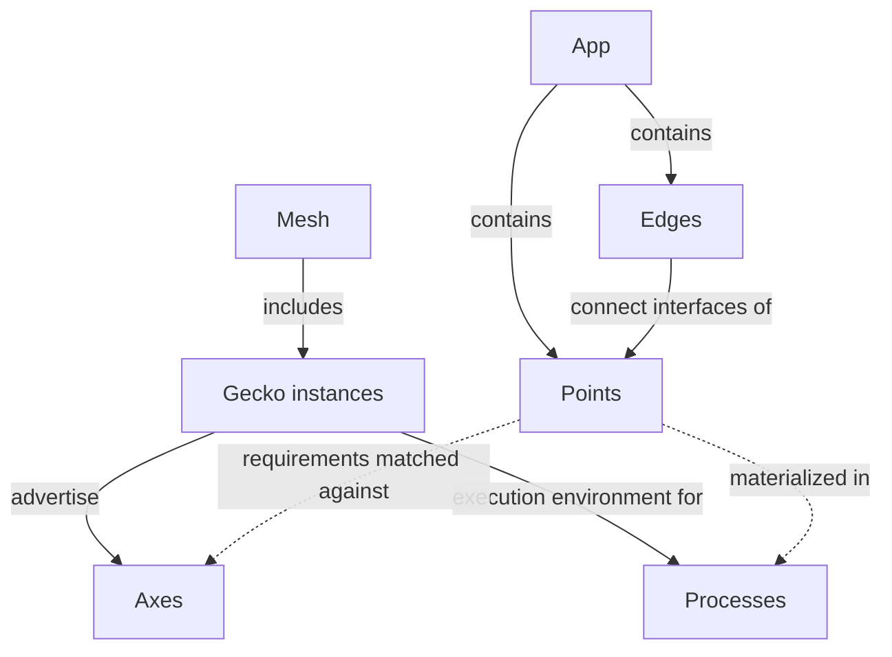

# Gecko — Initial Concept Map

Version 0.1 · October 4, 2026

This document establishes a shared vocabulary for designing the first versions of Gecko. It describes entities and their relationships. Specific APIs, configuration formats, process organization, and control algorithms will be chosen separately.

The source is the ChatGPT conversation [“Gecko and Kubernetes Comparison”](https://chatgpt.com/g/g-p-6a1ac79a34548191ac02427895e5a00f/c/6ac20d5b-1eb4-83eb-8543-d13148c2f8e1), originally titled “Сравнение Gecko и Kubernetes,” in the project named **Gecko** at the time of reading. The request referred to it as Gocker. The final vocabulary and later clarifications take precedence over earlier, broader assumptions.

**Status:** a working conceptual framework, rather than a description of implemented capabilities. The seven core terms come from the conversation's final table. The explanations below organize the discussion; recommendations for early versions and open questions are identified separately.

## 1. Core Idea

The user builds an **App** from functional **Points** connected by **Edges**. Instances of **Gecko** on different devices provide the execution environment. They form a **Mesh** and advertise their **Axes**, or capabilities. The logical application is materialized as concrete **Processes** and connection mechanisms on suitable Gecko instances.

The model has two main views:

- **What the application should do:** Points and Edges within an App.
- **Where and how it runs:** Gecko instances, their Axes, Processes, and concrete connection implementations.

Placement and materialization decisions connect these views. These decisions can initially be made manually; the conceptual model does not require an automatic scheduler.

## 2. Seven Core Terms

| Term | Definition | Example |
|---|---|---|
| **Gecko** | A running instance of the Gecko runtime on a particular machine or device. | `jetson-01`, `gpu-01`, `desktop-01` |
| **Mesh** | A collection of Gecko instances that have discovered one another and can interact. | A Jetson, GPU server, and desktop that can reach one another |
| **App** | A logical application described through functional elements and their connections. | An inspection application with a camera, analysis, viewing, and threshold control |
| **Point** | An addressable functional element of an App. Its name describes its place in the composition, rather than its size or complexity. | `Camera`, `Inference`, `Recorder`, `Slider`, `VideoView` |
| **Edge** | A logical connection between the interfaces of two Points. | `Camera.video → Inference.video` |
| **Axis** | A capability that a Gecko instance advertises externally. The plural is **Axes**. | `camera`, `cuda`, `tensorrt`, `ui.slider`, `storage` |
| **Process** | An actual operating system process involved in executing the application. | A process containing a GStreamer pipeline; a desktop UI process |

Here, “the Gecko project” refers to the entire system, while “a Gecko instance” refers to a particular runtime. A machine and a Gecko instance are also distinct: the machine provides the environment, and Gecko runs within it. This document does not yet constrain the number of instances on one machine.

### Reading Earlier Discussions

| Earlier Name | Current Term |
|---|---|
| Gecko Node / runtime node | **Gecko** |
| Gecko Mesh | **Mesh** |
| Graph, when referring to the application description | **App**; a graph describes its structure |
| Component / Graph Node / Dot | **Point** |
| Connection | **Edge** |
| Capability | **Axis** |
| OS process | **Process** |

Use “node” with care: a runtime instance is a Gecko, while an element of the logical graph is a Point.

## 3. Relationship Map



Solid arrows show structure and membership. Dashed arrows show relationships that must be resolved when preparing execution.

**App and Mesh are distinct.** An App describes the task; a Mesh describes the available environment. Discovering another Gecko expands the available capabilities, but does not by itself connect Points or rebuild a running App.

**Point, Process, and Gecko have different boundaries.** Several Points can run within one Process. Several Processes and pipelines can run on one Gecko. A composite Point can hide internal processing; a distributed implementation of such a Point remains a possible extension rather than a requirement for the first version.

## 4. What a Point Describes

The discussion identified four groups of properties for a functional element:

| Property | Question It Answers | Inference Example |
|---|---|---|
| Inputs | What does the Point receive? | Video; a threshold control value |
| Outputs | What does the Point produce? | Detection results |
| Parameters | How is its behavior configured? | A model reference; an initial threshold |
| Requirements | Which capabilities does the chosen implementation need? | A supported inference backend |

This describes responsibilities rather than a finished data schema. In particular, whether an adjustable threshold is a parameter with separate control or a full graph input remains to be decided.

A Point can represent a source, computation, recording, control, or display. A `Slider` produces a value, a `Button` produces an event, and a `VideoView` receives video. Including them in an App allows computation and user interaction to be described in the same vocabulary.

A large `Inference Point` may contain preprocessing, a model, and postprocessing. Whether and how to expose its internals as a subgraph is a separate decision. The enclosing App only needs a clear interface.

A **port** below means a named input or output of a Point. It is a supporting term for describing an interface, rather than an eighth core entity or a promise of a universal `Input<T>` API.

## 5. Edges and Connection Support

An Edge expresses intent, such as sending video from Camera to Inference. The actual transfer mechanism depends on the chosen Point implementations and execution boundaries.

Four contexts are useful to distinguish:

| Context | What Must Be Confirmed |
|---|---|
| One pipeline | Can the required elements be connected within it? |
| One Process | Is there a way to connect the implementations within a shared address space? |
| Separate Processes on one machine | Is there a suitable mechanism for interprocess communication? |
| Separate machines | Is there an implemented network path with suitable properties? |

Support in one context does not imply support in the others. Matching type names is also insufficient: data format, memory, codec, and other implementation requirements must be considered.

An important clarification from the conversation is that **`unsupported connection` is a valid validation result**. For example, two plugins might only connect within a single pipeline. Placing them on separate machines is then impossible; even a shared machine may be insufficient if they require a shared Process.

Three outcomes should be distinguished:

- **Supported:** a concrete mechanism can materialize the connection in the chosen context.
- **Unsupported:** no such mechanism exists; placement or implementations must change.
- **Supported, but conditions are unsuitable:** the mechanism exists, but measured bandwidth or latency does not meet the task's requirements.

An unperformed check means “not checked.” It does not confirm that the connection will work. Network measurements also have a time and conditions of measurement: a test result does not guarantee connection quality indefinitely.

Zenoh was discussed as a foundation for discovery, state exchange, control, and suitable data. A specific RTSP/RTP path was considered separately for video between machines. Transport choices still need to be confirmed through implementation for each case; universal transmission of every Edge through Zenoh has not been established.

## 6. Axis: Capability and Requirement

A Gecko instance inspects its local environment and advertises available capabilities. A Point states what its implementation requires. Matching the two helps determine valid placement.

```text
desktop-01 advertises: ui.slider, ui.video_view
Slider requires:      ui.slider
VideoView requires:   ui.video_view
```

Axis means capability here. The geometric name does not require a numerical scale; a separate Coordinate term is not needed yet.

**Capability and current availability are distinct.** Having CUDA or TensorRT does not establish that enough GPU memory is free for the chosen model. Having a camera does not confirm access to it at launch time. Axes, current resource state, and App requirements therefore need to be considered separately. Their exact representation remains open.

## 7. Desktop in the Shared Model

A desktop participating in App execution is another Gecko instance in the Mesh. It advertises UI capabilities and can materialize a Slider, Button, or VideoView. A device does not receive a special type merely because it is a laptop, Jetson, or server: its capabilities determine what it can do.

Two desktop interface modes were discussed:

| Mode | Audience and Purpose |
|---|---|
| **Admin / Editor** | An engineer discovers Gecko instances, inspects Axes, checks connections, builds an App, and diagnoses execution. |
| **Operator Interface** | A user sees video and the controls needed for the running App. |

These are interface roles rather than new App or Gecko types. An administrator role also does not follow automatically from having a `ui` Axis: control permissions must be designed separately.

If a desktop hosts Points belonging to a running App, its disappearance affects those Points. What happens to the remaining processing—continuing, stopping, or entering another state—depends on App policy. Automatic independence from closing the desktop is not yet guaranteed.

## 8. One App, Different Executions

Consider an inspection application:

```text
App: inspection

Camera.video ───────→ Inference.video
Inference.detections → VideoView.detections
Camera.video ───────→ VideoView.video
Slider.value ──────→ Inference.threshold
```

These are illustrative interface names rather than an approved API. Video, metadata, and the control value are deliberately shown separately.

### Local Variant from the Discussion

```text
Gecko: jetson-01
└── Process A
    └── GStreamer pipeline
        ├── Camera Point
        └── Inference Point

Gecko: desktop-01
└── Process B
    ├── VideoView Point
    └── Slider Point
```

Camera and Inference are implemented within one pipeline and Process. Separately supported paths for video, results, and control are needed between the Jetson and desktop. The presence of one path does not establish support for the others.

### Remote Inference Variant

```text
jetson-01                gpu-01                 desktop-01
Camera ── video ───────→ Inference ── metadata → VideoView
   └──────────────────── video ───────────────→ VideoView
                         Inference ←── value ── Slider
```

This variant is valid only if suitable Axes and implementations exist for every Edge crossing machine boundaries. RTSP/RTP was proposed for video in the discussion; the specific codec, network endpoints, and constraints still need to be chosen and checked.

The App's logical purpose remains the same while its physical implementation changes. Separate decoder, encoder, and network elements may be needed internally even if the user did not draw them as individual Points.

## 9. Intended Workflow

This is the target workflow from the conversation, rather than a list of implemented features:

1. The user starts Gecko on available devices.
2. Gecko instances inspect their environments and advertise Axes; the desktop discovers available Mesh participants.
3. The engineer sees capabilities and possible connection mechanisms; relevant network paths are tested.
4. A concrete App is assembled from Points and Edges in the Editor.
5. Point placement, grouping into Processes, and Edge materialization mechanisms are chosen.
6. Point requirements, connection support, and execution conditions are checked; limitations are explained.
7. The App starts. The operator receives the task interface, while the engineer receives state and diagnostics.

Discovery, connection selection, and execution are separate actions. The appearance of two compatible participants does not mean they should connect themselves to one another.

## 10. How the Kubernetes Comparison Fits

In the source conversation, the comparison helped define Gecko's domain: managing a media/AI application with an understanding of streams, processing, results, and connections. Managing process startup and state is part of this task, but does not describe the whole task on its own.

For this concept map, Kubernetes remains a possible execution environment for part of the system. Gecko's terms are defined through the user's task and the structure of the App; no direct correspondence between a Point and a Pod, or between a Mesh and a cluster, is established here.

Earlier proposals about choosing an available GPU, relocating inference, and automatically rebuilding a pipeline remain **development hypotheses**. The Kubernetes comparison alone does not make them commitments for early versions.

## 11. Guidance for Early Versions

**Recommendations from this document:**

- Describe the logical App separately from its chosen execution, keeping Points distinct from Processes and devices.
- Explicitly list supported Point and Edge implementations for the first working chain. A concrete `Camera → Inference` within one GStreamer pipeline is a possible starting point.
- When adding network execution, verify each new path separately and explain `unsupported` before launch.
- Allow manual placement; add automation after validated compatibility rules exist.
- Describe UI through Points and Axes, preserving the application's shared vocabulary.

These recommendations provide a way to discuss early decisions. They do not choose a programming language, libraries, SDK, containerization, or module boundaries.

## 12. Open Questions

| Question | Decision Needed |
|---|---|
| Who owns the App and applies changes? | Editor and runtime responsibilities; whether a controller is needed and what it does |
| How are Points, Edges, and Axes described? | Identity, interface types, versions, and configuration format |
| Where are Process boundaries? | Rules for grouping Points, fault isolation, and lifecycle |
| Which connections belong in the first version? | Specific implementation pairs, contexts, and supported transports |
| What happens when a Gecko disappears? | Response to loss of camera, compute, or UI; continuation and recovery policy |
| Which changes can be applied while running? | Parameter updates, branch rebuilding, and Process or App restarts |
| How are access permissions handled? | Who can discover Gecko instances, start an App, and change control values |
| When is automatic placement needed? | Metrics, selection criteria, relocation costs, and state preservation rules |

Automatic load balancing, Point migration, selection of a new App owner, seamless failover, and automatic merging of applications remain outside the established framework. They can be revisited through concrete scenarios and already validated implementations.
