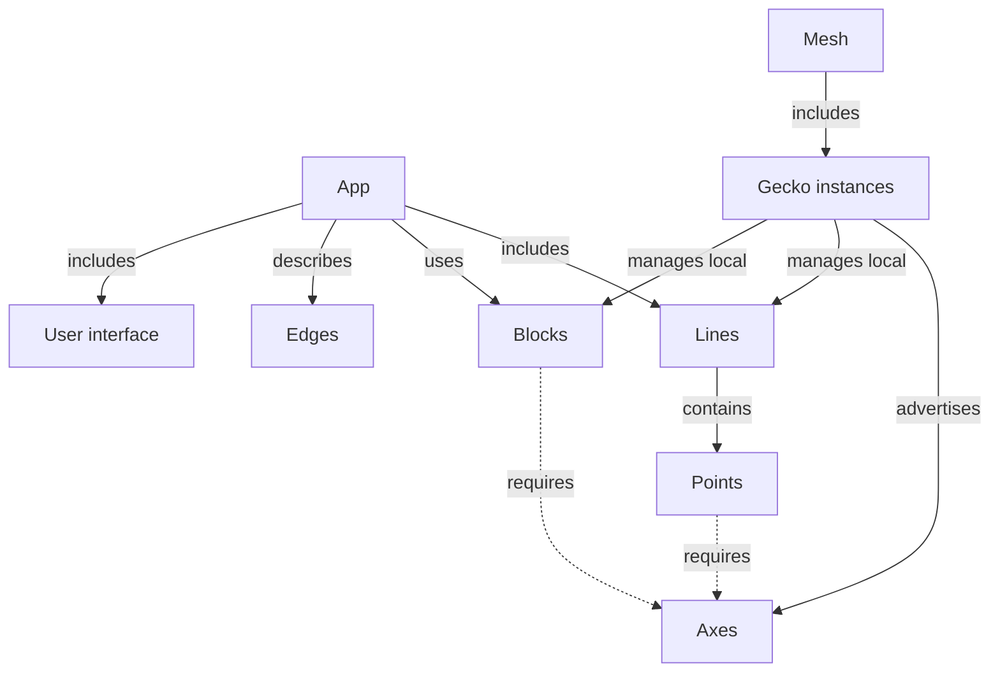

# Gecko — Concept Map

Version 0.2 · October 5, 2026 · [Русский](concepts.ru.md)

This document establishes a shared vocabulary for designing the first versions of Gecko. The concepts correspond to observable execution boundaries: devices, processing chains, and independent services. API formats, configuration formats, and concrete implementation mechanisms will be chosen separately.

The sources are the conversations [“Gecko and Kubernetes Comparison”](https://chatgpt.com/g/g-p-6a1ac79a34548191ac02427895e5a00f/c/6ac20d5b-1eb4-83eb-8543-d13148c2f8e1), [“Pipeline Architecture”](https://chatgpt.com/c/6ac273bd-a1c0-83eb-8759-4d3000c859d8), and subsequent vocabulary refinements in this chat. Line and Block restore a simple execution model; Point denotes a logical group within a Line.

**Status:** an agreed working framework for design. It does not describe implemented capabilities. Automatic placement, migration, load balancing, and seamless failover remain possible directions for future development.

## 1. Core Idea

A Gecko instance runs on a particular device, advertises available Axes, and manages Lines and Blocks placed on it. Gecko instances that can reach one another form a Mesh.

An App combines Lines, the Blocks they use, connections, and a user interface. A Line consists of Points and has a shared lifecycle. A Block provides an independent service that multiple Lines can use.

```text
App: inspection

Line front_camera ─┐
                   ├──→ Block inference
Line back_camera ──┘

Inside front_camera:
Source Point → Inference Point → Tracking Point → Output Point
```

An App describes the overall system. Lines and Blocks denote concrete managed execution units. Points describe the internal functional structure of a Line.

## 2. Eight Core Terms

| Term | Definition | Practical Boundary |
|---|---|---|
| **Gecko** | A running runtime instance on a particular machine or device. | Advertises capabilities and manages local Lines and Blocks. |
| **Mesh** | A collection of Gecko instances that have discovered one another and can interact. | The available environment; a new participant does not automatically rebuild an App. |
| **App** | A composition of Lines, Blocks, Edges, and a user interface that serves a task. | Can span several Gecko instances; has explicit membership and dependencies. |
| **Line** | A named processing chain of Points with shared configuration, lifecycle, and diagnostics. | When running, executes in one dedicated process on one Gecko. |
| **Point** | An addressable logical processing group within a Line. | Has interfaces, parameters, results, and metrics; this does not imply an independent process or restart. |
| **Block** | An independent service with its own interface, configuration, and lifecycle. | Can serve several Lines; a Gecko-managed Block executes in a dedicated process. |
| **Edge** | A logical connection between a specific output and input. | Connects Point interfaces within a Line, or exposed Line and Block interfaces at App level. |
| **Axis** | An execution capability advertised by a Gecko instance. The plural is **Axes**. | Matched against the requirements of selected Point and Block implementations. |

“The Gecko project” refers to the whole system, while “a Gecko instance” refers to a particular runtime. A machine provides the environment for Gecko. This document does not constrain the number of instances on one machine.

The geometric names reflect structure: a Point is a functional point within a Line; a Line is a processing chain; a Block is an independent service unit; an Edge is a connection. The vocabulary uses Point. Dot is not introduced as a separate entity.

## 3. Structure and Execution Boundaries



A Line has an explicit boundary: one Gecko and one dedicated process during execution. Placement applies to the whole Line. Its Points cannot independently move to other machines without changing the execution structure.

**One source → one Line is the default policy.** A source can be a camera, file, or another supported source. Multiple inputs within one Line are possible when that scenario is explicitly supported; this is not a commitment for the first version.

An independent service is represented as a Block. Sharing a Block does not merge Lines or change their restart boundaries.

UI elements belong to the App's interface. Slider, Button, and VideoView are not processing Points within a Line. They connect to accessible interfaces and parameters of Lines, their Points, and Blocks. The dedicated-process rule for a Line or Block does not apply to each UI element.

## 4. A Line and Its Points

A Line is the main operational unit for processing: `start`, `stop`, `pause`, `resume`, `reload`, `restart`, state, health, and logs. Operation availability and exact semantics depend on the implementation.

A Point groups elements that implement one understandable function:

```text
Inference Point
├── preprocessing
├── inference client or local inference
└── postprocessing
```

A Point can be complex and composite, but remains within its Line. It does not hide additional independent Lines or Blocks. If its function uses a remote service, that dependency is displayed explicitly.

| Point Property | Example |
|---|---|
| Inputs and outputs | Video input, detections output |
| Parameters | Model, threshold |
| Implementation requirements | A supported inference backend |
| Diagnostics | Latency, errors, input and output previews |

Point addressability allows changing `front_camera.detector.threshold` or inspecting its metrics. It does not imply an independent `restart(detector)`. A change may apply while running or require rebuilding or restarting the Line; this must be visible before applying it.

A Line and a GStreamer pipeline also describe different levels. A Line is a Gecko object with a stable name and lifecycle; a GStreamer pipeline is a concrete implementation of its processing. They may correspond directly in the first scenarios.

## 5. Blocks and Shared Use

A Block has its own lifecycle and can serve multiple consumers. Examples include a shared inference server or a storage service. An App records its dependency on a Block; this does not imply exclusive ownership of the service.

```text
Line front_camera → Inference Point ─┐
                                    ├──→ Block inference
Line back_camera  → Inference Point ─┘
```

Each Line has its own Inference Point that prepares requests and receives responses. The shared Block performs computation. Restarting one Line should not by itself restart the shared Block. Restarting or losing the Block can affect every dependent Line.

There are two ways to connect a Block:

- **Managed:** Gecko starts and stops the service in a dedicated process and provides state and diagnostics.
- **External:** the App uses an existing service, such as Triton. Gecko does not have to own its process or provide restart operations for it.

These modes do not require additional core terms. The interface must show which management operations are available and which Lines depend on the Block.

## 6. Edges and Many-to-Many Connections

**Each Edge connects one specific output to one specific input.** Multiple Edges form a many-to-many topology: one Line can use several Blocks, and one Block can serve several Lines.

Within a Line, Edges connect Point interfaces. At App level, they connect exposed Line and Block interfaces. For example, `front_camera.video` may expose a selected video output of its Source Point. An external connection does not change the Point's membership in its Line.

Fan-out, multiple senders to one input, and stream mixing require support from the corresponding interfaces. They cannot be inferred from the shape of the graph alone.

An Edge must have a concrete supported implementation mechanism:

| Context | What Is Checked |
|---|---|
| Between Points in one Line | Implementation compatibility within the shared chain and process |
| Between Lines or Blocks on one Gecko | An implemented interprocess communication mechanism |
| Between different Gecko instances | A supported network path, formats, and transfer conditions |

`unsupported connection` is a valid validation result. Distinguish supported; unsupported; supported but conditions are unsuitable; and not yet checked. Matching types and available Axes do not guarantee a connection.

Zenoh is considered for discovery, state, control, and suitable data. RTSP/RTP was considered for video between machines. Universal transfer of every Edge through Zenoh is not assumed. Bandwidth and latency measurements are tied to their time and test conditions.

## 7. Who Advertises Axes

**Gecko advertises Axes.** Points and Blocks describe the requirements of their selected implementations. A Line's requirements combine those of its Points and internal connections; placement validation considers the whole Line.

```text
Gecko jetson-01 advertises: camera, gstreamer, tensorrt
Gecko desktop-01 advertises: ui.slider, ui.video_view

Inference Point requires: a supported inference backend
Line camera_front requires: capabilities for all its Points
```

Requirements belong to a particular implementation. An Inference Point with a local model and an Inference Point using a Block may have different requirements. A remote Block does not turn its GPU into a local Axis of another Gecko instance.

Capability and current resource availability are distinct: having TensorRT does not confirm free GPU memory, and having a camera does not confirm access at launch. Resources, dependency availability, and Edge support are checked separately.

## 8. Process Is a Technical Detail

Process is not part of the core domain vocabulary. The execution rules for managed units are:

```text
1 running Line          → 1 dedicated OS Process
1 running managed Block → 1 dedicated OS Process
```

A Line or Block retains its identity across restarts; the PID changes. Configuration and diagnostics belong to the stable name, while the PID is shown as technical information.

```text
Line camera_front → PID 1234
       restart
Line camera_front → PID 5678
```

`pause` means suspending processing according to runtime rules, rather than necessarily suspending the process through the OS. `reload` means applying configuration and may require a restart. These operations do not promise seamless application of every change.

The dedicated-process rules do not describe the internals of the Gecko runtime itself, desktop UI, or external Blocks. Process isolation also does not remove shared dependencies on devices and services.

## 9. Placement, Distributed Processing, and UX

An App can run across several Gecko instances. Each Line and managed Block is placed entirely on one Gecko. Moving a Point beyond its Line requires an explicit transformation: using a Block or extracting part of the processing into another Line with a supported Edge.

```text
jetson-01                         gpu-01
Line capture ── video Edge ───→ Line analysis

or:
Line camera with Inference Point ──→ Block inference
```

Both variants must be checked as concrete implementations. One App does not imply a shared process or one atomic pause: an App operation coordinates its participants according to a chosen policy. A shared Block should not automatically stop if other applications use it.

The Editor shows an App with Lines and Blocks. Expanding a Line reveals its Points. Lifecycle and placement are available at Line level; parameters and diagnostics are available at Point level. Required restarts are visible before changes; dependent consumers are visible before restarting a Block.

A desktop participating in an App is also a Gecko with UI Axes. Admin / Editor and the operator screen are interface roles. An operator can see only video and the necessary controls. Administrator permissions do not follow from having a UI Axis.

## 10. Workflow for Early Versions

1. Start Gecko on available devices; discover Mesh participants and their Axes.
2. Create an App, add Lines and required Blocks, and assemble Points within Lines.
3. Expose the required interfaces and connect them with Edges; connect the user interface to data and controls.
4. Select a Gecko for each Line and managed Block, or specify an external Block.
5. Check requirements, resources, dependencies, and every connection mechanism; explain limitations before launch.
6. Start the selected units. Show Line and Block state and Point diagnostics.
7. Apply changes with their scope clearly identified: a Point parameter, a Line restart, or a Block operation.

Manual placement is sufficient for the first version. Discovery alone does not connect participants or rebuild an App. The initial practical scenario is one camera or file, one Line, and one dedicated process; shared inference is added through a Block.

## 11. Changes from Version 0.1

| Previously | Now |
|---|---|
| An App is an arbitrary graph of Points | An App is a composition of Lines, Blocks, Edges, and UI |
| A Point is a functional entity of any scale | A Point is a logical group within a Line with an explicit execution boundary |
| Points are arbitrarily grouped into Processes | Points are organized into Lines; a Line is the placement and lifecycle unit |
| Pipeline is an internal detail | Line is the main managed processing chain |
| Process is a core concept | Process is an execution mechanism and diagnostic detail |
| Shared services are not distinguished | Block is an independent service with explicit dependencies |

Earlier names Component / Dot correspond to Point only in the context of internal Line processing. Capability corresponds to Axis, and Connection to Edge. Qualify “node”: Gecko is a runtime instance; Point is an element within a Line.

The Kubernetes comparison retains its original meaning: Gecko understands media/AI processing and its connections. Kubernetes can provide an execution environment for part of the system. This map does not establish a direct correspondence between a Line or Block and a Pod.

## 12. Open Questions

- Configuration and interface formats, their versions, and identity.
- Rules for exposing Point interfaces through a Line; the distinction between parameters and control inputs.
- Concrete Point, Block, and Edge implementations for the first version.
- Pause/reload semantics, policy for loss of a source, Block, or desktop, and the order of App operations.
- Shared Block ownership, access by multiple Apps, and control permissions.
- When automatic placement, migration, load balancing, and recovery are needed.

These questions refine implementation while preserving the foundation: Gecko manages Lines and Blocks; Points organize processing within a Line; Edges connect specific interfaces; Axes describe Gecko capabilities.
