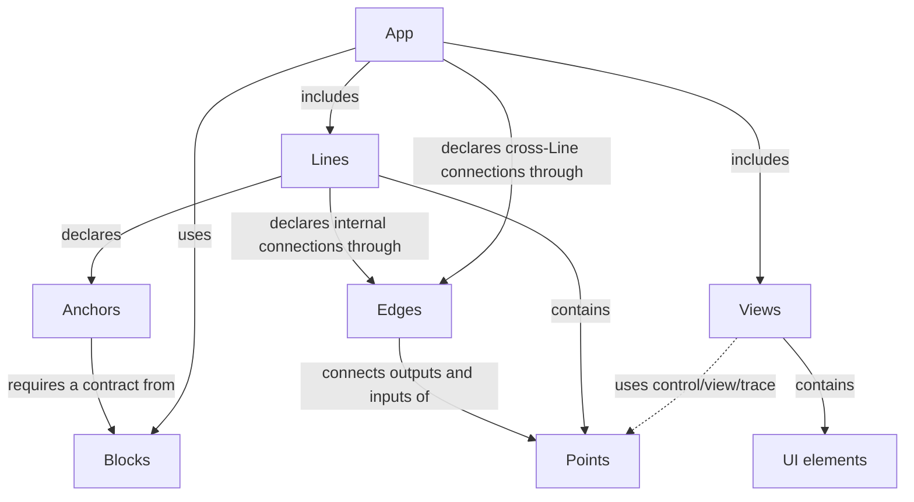
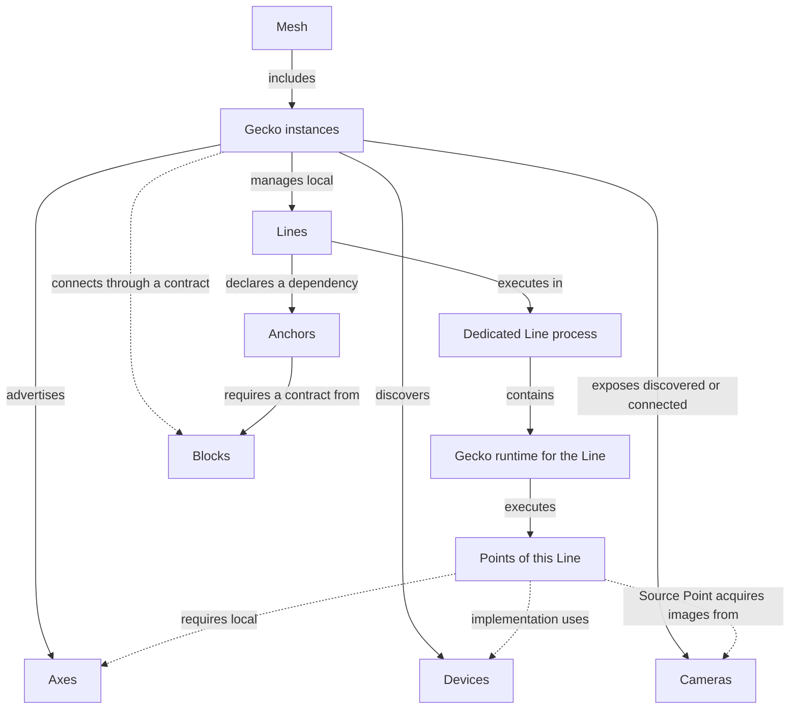

# Gecko — Concept Map

Version 0.7 · October 10, 2026 · [Русский](concepts.ru.md)

This document establishes a shared vocabulary for designing the first versions of Gecko. An App defines a shared experience for working on a task, from available capabilities to a verifiable result. The other concepts describe processing, its execution, supported connections, and dependencies on shared services. API formats, configuration formats, and concrete implementation mechanisms will be chosen separately.

The sources are the conversations [“Gecko and Kubernetes Comparison”](https://chatgpt.com/g/g-p-6a1ac79a34548191ac02427895e5a00f/c/6ac20d5b-1eb4-83eb-8543-d13148c2f8e1), [“Pipeline Architecture”](https://chatgpt.com/c/6ac273bd-a1c0-83eb-8759-4d3000c859d8), and subsequent vocabulary refinements in this chat. A Line defines a concrete execution unit; a Point denotes a logical group within a Line; a Block is defined by a domain contract, and an Anchor explicitly describes a Line’s dependency on its provider. A Device denotes the hardware on which selected implementations execute.

**Status:** an agreed working framework for design. It does not describe implemented capabilities. Capability discovery, automatic connection checks, proposed App compositions, and preparation of known services are part of the target UX. The scope of the first version will be chosen separately; migration of running participants, load balancing, and seamless failover do not follow from this workflow.

## 1. Core Idea

The user starts Gecko instances on available machines and platforms. Each Gecko instance discovers accessible Devices, exposes discovered or explicitly connected Cameras, and advertises Axes, known processing implementations, and connected services. Gecko instances that can reach one another form a Mesh; supported connection checks provide bandwidth and latency measurements.

For a task, Gecko proposes processing compositions and placements based on Mesh capabilities. An App combines a composition description with the interaction available to its user: discover capabilities, assemble or select an option, validate it, start it, observe results, and change processing. The selected option has an explicit configuration of Lines, supported connections, dependencies on Blocks, and Views that can be saved. A Line consists of Points and executes in one dedicated process with the Gecko runtime. A Block is defined by a domain contract understood by Gecko; a service satisfying that contract is connected as a Block. An Anchor defines a particular Line’s dependency on that provider. A View presents selected App data, controls, and diagnostics to the user.

```text
App: inspection

Camera front → Source Point in Line front_camera
Camera back  → Source Point in Line back_camera

Line front_camera ── Anchor detector ──→ Block inference
Line back_camera  ── Anchor detector ──→ Block inference

Inside front_camera (connections use supported Edges):
Source Point → Inference Point → Tracking Point → Output Point
```

An App describes the composition and connections of Lines, their Points, and the Blocks they use for a particular task. A Line defines a concrete execution boundary, and Points describe its internal functional structure. A Block’s contract and a particular provider of that contract are distinct. A container, external service, or Gecko-native implementation can provide the same contract; a Block does not define their deployment mechanism or process ownership.

### 1.1. App as a Shared Interaction Experience

**Lowering the threshold for testing an idea is Gecko’s responsibility.** An App defines a shared experience for working on a task regardless of the interaction mechanism. Its user may be an engineer, an agent, or a programmatic consumer. Available capabilities, their usage conditions, actions, and results must have the same meaning for all users; the particular presentation is chosen separately.

Gecko immediately exposes known Device, Camera, Axis, Point, Edge, and Block capabilities, Anchor conditions, and available data representations. From these it proposes supported App options and explains what is ready now, what can be prepared, and what is missing. The presence of a device alone does not promise working processing: compatibility, resources, and dependency readiness are considered.

The user specifies a task, input data, and constraints, receives available options, and evaluates the result. Gecko performs capability discovery, execution selection, and dependency validation. Technical details remain available for diagnostics and manual control; learning the entire execution structure should not be a prerequisite for the first experiment.

The target cycle is **task and input data → App option → first observable result → change → repeat evaluation → deployment to the operational environment**. The main criterion for this experience is the time and number of required actions from intent to the first verifiable result on real data. Available models and data limit which hypotheses can be tested; the App makes these limitations explicit.

## 2. Twelve Core Terms

| Term | Definition | Practical Boundary |
|---|---|---|
| **Gecko** | A running runtime instance on a particular machine or platform. | Discovers Devices, exposes Cameras, advertises capabilities, manages local Lines, and connects Blocks through contracts; may support preparation of known services. |
| **Mesh** | A collection of Gecko instances that have discovered one another and can interact. | Supports connection checks and proposed App compositions; a new participant does not change a running composition by itself. |
| **App** | A composition for a task and a shared experience for interacting with its capabilities, actions, and results. | Gecko provides selection, validation, startup, observation, and modification regardless of interaction mechanism; the selected option records Lines, Edges, Anchors, Blocks, Views, implementations, and placement. |
| **Line** | A named processing chain of Points with shared configuration, lifecycle, and diagnostics. | A concrete execution unit: one dedicated process with the Gecko runtime on one Gecko instance. |
| **Point** | An addressable logical processing group within a Line. | Declares processing interfaces and control/view/trace capabilities; this does not imply an independent process or restart. |
| **View** | A user-facing representation of an App combining data and state displays with available user actions. | Consists of UI elements explicitly bound to declared App capabilities; a visual representation is not required to access App capabilities and does not define a separate process. |
| **Block** | A domain service capability defined by a Gecko contract. | A particular service is connected as a Block after contract validation; hardware requirements and startup belong to the provider implementation. Can serve several Lines. |
| **Anchor** | A Line’s dependency on a shared service, specifying the required contract and the conditions under which the Line can operate. | References a particular Block; records required capabilities, readiness conditions, and behavior when unavailable. |
| **Edge** | A supported way to connect one Point’s output to another Point’s input, with defined rules and constraints. | Applied to particular Point interfaces during assembly; the Points may belong to the same Line or different Lines. An exposed Line interface refers to a Point interface. |
| **Axis** | An execution capability advertised by a Gecko instance. The plural is **Axes**. | Matched against local requirements of selected implementations; Block availability is checked through Anchors. |
| **Device** | An addressable hardware execution unit accessible to a particular Gecko instance. | A CPU, GPU, or other accelerator with characteristics, internal structure, resources, and state; it is neither a Block nor an Axis. |
| **Camera** | An addressable source of images from a particular camera, discovered or explicitly connected to Gecko. | Exposes known streams or image acquisition modes and access conditions. A Source Point acquires its data for a Line; a Camera retains its identity independently of the Line and is not a compute Device, Point, or Axis. |

“The Gecko project” refers to the whole system, while “a Gecko instance” refers to a particular runtime. A machine provides the environment for Gecko. This document does not constrain the number of instances on one machine.

The geometric names reflect structure: a Point is a functional point within a Line; a Line is a processing chain; a Block is a service capability defined by a contract; an Edge is a supported way to connect; an Anchor is a Line’s support from a service; a View is a projection of an App for the user. Hardware keeps the familiar name Device without a geometric renaming. The vocabulary uses Point. Dot is not introduced as a separate entity.

## 3. Structure and Execution Boundaries

### 3.1. App Composition

This diagram describes application composition and relationships between concepts. A Line contains Points. Every processing connection through an Edge joins a Point output to a Point input, whether the Points belong to the same Line or different Lines. A Line declares internal connections; the App declares connections across Line boundaries. Anchors describe dependencies on Blocks. Cameras and Devices belong to the execution environment shown in section 3.2.



UI elements belong to the App’s Views. Slider, Button, and VideoView are not processing Points within a Line. They bind to declared capabilities of Lines, their Points, and Blocks. The dedicated-process rule for a Line does not apply to a View or each UI element.

### 3.2. Environment and Execution Boundaries

This diagram describes placement and execution. An App can span several Gecko instances; a particular Line executes entirely on one of them. Gecko exposes discovered or connected Cameras; a Source Point within a Line acquires their images. A Camera may be local or networked. Connecting a Block through a contract does not imply placing its process on that Gecko instance.



A Line has an explicit boundary: one Gecko instance and one dedicated process with the Gecko runtime during execution. Placement applies to the whole Line. Its Points cannot independently move to other machines without changing the execution structure.

**One source → one Line is the default policy.** A source can be a camera, file, or another supported source. Multiple inputs within one Line are possible when that scenario is explicitly supported; this is not a commitment for the first version.

A Block has its own service boundary defined by its implementation. Sharing a Block does not merge Lines or change their restart boundaries. Gecko may manage service startup where supported, but does not impose a “one dedicated process” rule on every Block.

### 3.3. Camera and Image Acquisition

A Camera denotes a particular image source, such as a locally connected or network camera. Gecko exposes its stable name, known streams and modes (format, resolution, frame rate), access state, and supported actions. Discovery and control depend on the connection implementation; information that cannot be obtained is marked unknown.

A Source Point selects a Camera and a supported stream or mode, acquires images, and exposes them through its processing interface. The Camera binding is saved in the App configuration. Subsequent connections through Edges join Point interfaces. Restarting a Line does not change the Camera’s identity and does not by itself restart the camera.

```text
Camera entrance → Source Point in Line entrance → Edge → Inference Point
```

A Camera describes a particular source; an Axis describes Gecko’s ability to work with a supported source type; a Device is hardware for executing processing. A recorded file can be a Source Point input for an experiment, but does not itself become a Camera. The “one source → one Line” policy does not imply exclusive ownership of a Camera: use by multiple Lines requires connection support or shared acquisition, along with validation of access and load constraints.

## 4. A Line and Its Points

A Line is the main operational unit for processing: `start`, `stop`, `pause`, `resume`, `reload`, `restart`, state, health, and logs. Operation availability and exact semantics depend on the implementation.

A Point groups elements that implement one understandable function:

```text
Inference Point
├── preprocessing
├── inference client or local inference
└── postprocessing
```

A Point can be complex and composite, but remains within its Line. It does not hide additional independent Lines or Blocks. If its function uses a shared service, the dependency is declared through its Line’s Anchor and displayed explicitly.

| Point Property | Example |
|---|---|
| Inputs and outputs | Video input, detections output |
| Parameters | Model, threshold |
| Implementation requirements | A supported inference backend |
| Diagnostics | Latency, errors, input and output previews |

Point addressability allows changing `front_camera.detector.threshold` or inspecting its metrics. It does not imply an independent `restart(detector)`. A change may apply while running or require rebuilding or restarting the Line; this must be visible before applying it.

A Line and a GStreamer pipeline also describe different levels. A Line is a Gecko object with a stable name, lifecycle, and dedicated process with the Gecko runtime; a GStreamer pipeline is a concrete implementation of its processing within that runtime. They may correspond directly in the first scenarios.

### 4.1. Point Contract: Control, View, and Trace

**Control, data presentation, and tracing are designed alongside processing.** A Point declares its capabilities so that Gecko can expose available data, parameters, commands, and their usage conditions to any App user. These descriptions are part of the Point contract from the first version; specific capability sets depend on the implementation. UI hints describe possible presentation, but access to the contract does not require a visual interface.

| Contract Part | What the Point Declares | Possible UI Elements |
|---|---|---|
| **Control plane** | Parameters, types, ranges or choices, available commands, application conditions, and result acknowledgment | Slider, input field, model selector, action button |
| **View plane** | Available data representations, their formats and meaning: previews, images, detections, tables | VideoView, image viewer, overlay, results table |
| **Trace plane** | Processing events, errors, durations, metrics, and identifiers relating events to inputs and results | Timeline, latency graph, frame or request path inspector |

A View as an App object is distinct from the view plane: the plane declares available data representations, while a View assembles a user-facing screen from capabilities of all three planes.

The control plane describes whether a change can apply while running, whether it requires rebuilding or restarting the Line, and when it is considered applied. Point commands do not introduce an independent lifecycle: `restart(detector)` does not appear automatically. Lifecycle operations belong to the Line.

The view plane describes available representations, not a finished screen. A Point may suggest a preferred UI element, such as a Slider for a numeric parameter or an overlay for detections; the View selects the actual presentation. Formats and coordinate systems must allow bindings to be validated, such as the compatibility of detections with the displayed image.

The trace plane relates events to a particular Line, Point, and processed frame or request. Across Point and Line boundaries, the contract must allow event correlation to be preserved. Unrelated logs do not replace a trace. Collection completeness, sampling, and history storage will be defined separately.

```text
Inference Point detector

Control:
  threshold: number 0…1, change while running
  model: select from a list, change requires Line restart

View:
  input_preview: image
  detections: results with coordinates and frame identifier

Trace:
  inference_started / completed / failed
  duration, frame_id / request_id
```

This is an example contract, not a universal requirement for every inference implementation. The Point declares capabilities; the Line runtime exposes them; Gecko makes them available through the App for observation and permitted actions. A View uses the same contract for data presentation and control. Configuration preserves explicit UI bindings to parameter, command, and representation addresses. These bindings are neither processing Edges nor service dependency Anchors. API formats and transports for these planes have not been selected.

### 4.2. Selecting a Point Implementation

A Point’s function and contract differ from its execution mechanism. For example, an Inference Point may have implementations for a CPU, an NVIDIA dGPU, the Jetson platform, or calling an inference Block through an Anchor. These are alternatives with their own conditions, rather than a flat list of interchangeable devices. Options must satisfy the required Point contract; compatibility with neighboring Points and Edges is checked separately.

During App composition, the selection mechanism chooses compatible implementations and placement for the whole Line from known options, considering the task, constraints, and user preferences. The App saves the selected option or an explicitly permitted selection policy. Gecko validates the configuration and binds execution to particular Devices. The user can select an option manually or pin an implementation and placement.

A Line’s own requirements, such as the architectures supported by its runtime, apply together with Point and internal Edge requirements. Runtime support for x86_64 and arm64 does not mean every Line composition supports both architectures. Moving from local inference to a Block changes dependencies and requires an Anchor; selection before startup does not imply automatic switching while running.

## 5. Blocks and Anchors: Shared Services and Dependencies

**A Block is defined by a domain contract; an Anchor describes a Line’s dependency on a provider of that contract.** For example, an inference contract describes model execution, while a recording storage contract describes writing and reading video segments by camera and time. A running service, container, or Gecko-native implementation becomes a connected Block when it satisfies the contract. An arbitrary process or database nearby does not become a Block merely by exposing a port.

A Block’s contract describes available operations, inputs and results, request/response correlation, errors, and available diagnostics. For inference, it must expose models and versions, their inputs and outputs, invocation rules, and handling of overload or timeout. The exact contract format will be selected separately.

```text
Line front_camera ── Anchor detector ──→ Block inference
Line back_camera  ── Anchor detector ──→ Block inference

Anchor detector:
  required contract: inference
  required capability: selected model and version
  readiness: service reachable, contract compatible, model ready
  behavior when unavailable: explicitly selected Line policy
```

Each Line has its own Inference Point that prepares requests and receives responses. A Point uses a Block through the Line’s declared Anchor; configuration shows which Points use that dependency. The Anchor itself is not a transport: calls are implemented by a contract client or adapter. A Line can have several Anchors, and several Lines can have Anchors referencing one Block.

A Block provider binding is saved explicitly: service name, contract and version, address or built-in binding, and a supported connection implementation. The App composition mechanism may propose it, or the user may specify it. For a third-party service such as Triton, an adapter translates its interface into a Gecko contract, checks compatibility, and discovers available capabilities. A service built for Gecko can implement the contract directly. A process, container, or open port does not replace this validation.

A supported way to fulfill the contract is mandatory. An external service can use its own protocol through an adapter. Discovered service declarations participate in proposed App compositions; Anchor bindings are recorded in the selected composition rather than created merely by discovery.

Restarting a Line does not by itself restart a shared Block. A Block failure can affect all dependent Lines; each Line’s reaction is defined by its Anchors. Declared Blocks and Anchors remain in the App when a service is unavailable. Contract compatibility, service availability, and readiness of the required capability are displayed separately. An Anchor does not imply exclusive ownership of a Block.

### 5.1. An Available Provider and the Ability to Prepare One

A Block contract does not require a particular CPU, GPU, or container. Those requirements belong to the provider implementation. A node distinguishes a running contract provider from a known implementation it can prepare. Suitable hardware alone implies neither a ready Block nor the ability to start one automatically.

| State | Condition | Representation in an App Option |
|---|---|---|
| Available now | The provider is connected, the contract is compatible, and the required capability is ready | Can be used after Anchor validation |
| Can be prepared | The implementation, its requirements, and a supported preparation mechanism are known | Requires preparation with visible steps and results |
| Requires external preparation | A provider is needed, but Gecko cannot prepare it | The dependency is unsatisfied; the missing condition is explained |

An implementation can report its backend, Devices in use, location, and reasons for not being ready. This information exposes the provider’s hardware dependency without making it part of the Block contract. Unknown hardware information about an external service is marked unknown; Gecko does not infer it from a service name or a local GPU.

### 5.2. Optional Preparation and Startup Management

Service preparation is an optional Gecko capability, separate from a Block’s contract and App composition. Connecting an existing service does not require it. For the target UX of “task and input data → App option → verifiable result,” preparation of known providers must be designed alongside composition selection.

| Provider Execution Mechanism | Gecko’s Responsibility |
|---|---|
| An already running external service | Connect and validate the contract and readiness; process management is not assumed |
| A separate program or script | Use a known preparation and startup mechanism, then validate the result |
| A container | Call a supported container runtime or external manager, then validate the service |
| Gecko-native | Create a built-in service through the same contract; execution inside the Gecko process or in a separate process is implementation-defined |

A supported implementation describes requirements, installation, parameters and artifacts (including models), startup, readiness checks, logs, shutdown, and cleanup of created resources. Calling a script is not itself confirmation that a Block is ready. Gecko reports preparation steps, errors, and required actions in service terms. A limited set of known implementations with described lifecycles is preferred for the first version; arbitrary scripts and containers are not automatically supported.

An App saves the selected provider and, where needed, its preparation parameters. Deployment does not become part of the domain contract. Gecko does not have to implement its own container runtime, universal orchestrator, migration, or load balancing. A built-in provider shares resources and the failure risk of the Gecko process; that execution mechanism does not provide process isolation for the Block.

A created provider records its lifecycle owner and dependent consumers. Stopping an App does not automatically stop a shared Block. Reuse, shutdown, and cleanup rules must account for other Apps and Lines; a preparation failure must not delete an external service Gecko does not own.

## 6. Edges: Supported Processing Connections

**An Edge predetermines a supported way to connect one Point’s output to another Point’s input.** It defines interface compatibility, the data transfer mechanism, and constraints. The supported mechanism and a particular connection using it are distinct: during assembly, each connection records the source Point and output, destination Point and input, and selected Edge mechanism and settings. Multiple such connections can form a many-to-many topology.

Both endpoints are always Point interfaces. Within a Line, Edges define allowed Point connections implemented by the Gecko runtime. At App level, they connect Points belonging to different Lines through interfaces explicitly exposed by those Lines. For example, `front_camera.video` may expose `front_camera.source.video`: the Line-level name refers to its Source Point’s output. Exposing an interface does not create a separate processing endpoint or change the Point’s membership in its Line. The exposed Point need not be the first or last Point in the Line; its selected input or output must be explicitly available for external connections.

```text
Within one Line:
front_camera.source.video ── Edge ──→ front_camera.detector.video_in

Across Line boundaries:
capture.source.video ── Edge ──→ analysis.detector.video_in
```

A Point has inputs and outputs, but matching data types alone does not permit a connection: a supported Edge must exist. Gecko exposes allowed connections and explains constraints before execution. Fan-out, multiple senders to one input, and stream mixing require explicit support.

| Context | What the Edge Must Support |
|---|---|
| Between Points in one Line | Implementation compatibility within the shared chain and process |
| Between Points in different Lines on one Gecko instance | A concrete interprocess data transfer mechanism |
| Between Points in Lines on different Gecko instances | A concrete network path, formats, and transfer conditions |

`unsupported connection` is a valid validation result. Distinguish supported; unsupported; supported but conditions are unsuitable; and not yet checked. Available Axes do not guarantee a connection. The status of a particular connection is diagnostic information, not the definition of an Edge.

A Line’s dependency on a Block is described by an Anchor. Checks such as “is Triton reachable?” and “is the model ready?” belong to the Block and Anchor. Block calls are implemented by a domain contract client or adapter; they do not need to be represented as Edges.

Concrete transports will be selected separately for supported connection mechanisms. Bandwidth and latency measurements are tied to their time and test conditions.

## 7. Axes, Devices, and Execution Requirements

**Gecko advertises Axes.** A Device describes particular hardware; an Axis describes an available environmental capability considering hardware, software, and access. Points describe the local requirements of their selected implementations. A Line’s own requirements and those of its Points and internal Edges must all hold; placement validation considers the whole Line. If Gecko prepares a Block provider, that implementation’s requirements are checked separately at its execution location. A Line’s domain requirements for a Block are described by Anchors, not Axes.

```text
Gecko jetson-01 advertises: camera, gstreamer, tensorrt
Gecko desktop-01 advertises: ui.slider, ui.video_view

Inference Point requires: a supported inference backend
Line camera_front requires: capabilities for all its Points
```

Requirements belong to a particular implementation. An Inference Point with a local model and an Inference Point using a Block through an Anchor may have different local requirements. A remote Block does not turn its GPU into a local Axis of another Gecko instance.

Capability and current resource availability are distinct: having TensorRT does not confirm free GPU memory, and having a camera does not confirm access at launch. Resources, Anchor conditions, and Edge support are checked separately.

### 7.1. A Device and Its Internal Resources

A Device is a CPU, discrete or integrated GPU, NPU, or other hardware accelerator that Gecko identifies and selects individually for execution. ARM/x86 are CPU architecture characteristics, while Jetson or an embedded board is a platform containing accessible Devices. For the first version, a CPU can be represented as one Device per machine, describing cores and logical CPUs within it; socket and NUMA detail can be added when needed.

```text
Gecko jetson-01
├── platform: Jetson
├── Device cpu-0: arm64 architecture, cores, and logical CPUs
├── Device gpu-0: characteristics, memory, state
├── Camera entrance: connection, streams and modes, access state
└── Axes: verified available execution capabilities
```

Each CPU core is not a separate Device. Cores, threads, memory, and other internal resources are considered during placement and execution. Affinity, quota, and exclusive reservation are different conditions; binding to logical CPUs does not itself mean exclusive allocation. Concrete resource allocation mechanisms will be chosen separately.

One Line may use several Devices, such as a CPU for data preparation and a GPU for inference, while remaining one process on one Gecko instance. Physical presence of a Device does not guarantee an available Axis: compatible software and actual access are required. Several Gecko instances on one machine may share hardware; node advertisements do not imply independent resource inventories.

### 7.2. The App Dependency Graph

App composition can be expanded as a tree, but execution dependencies form a graph: several Lines may share a Block or Device. App validation combines participant results while preserving each dependency’s execution location.

```text
App inspection
├── Line camera: its own runtime requirements
│   ├── Source Point: implementation requirements, binding to Camera entrance
│   ├── Inference Point: selected option requirements
│   │   └── local binding to Device gpu-0
│   └── internal Edges: compatibility and resource requirements
└── Line archive
    └── Anchor storage → Block recordings
                          └── provider: separate implementation requirements
```

A Line combines its own requirements with those of its Points and internal Edges. When using a Block, the Line requires its contract and readiness through an Anchor; a remote provider’s hardware requirements do not become local Line requirements. Shared diagnostics can expose Device relationships reported by the provider. No additional term is introduced for a hardware dependency: requirements and concrete bindings belong to execution configuration.

## 8. Process and Concrete Line Execution

Process is not part of the core domain vocabulary, but a Line’s execution boundary is concrete:

```text
1 running Line → 1 dedicated OS Process with the Gecko runtime
```

The runtime executes Points and supported connections within the Line. A Line retains its identity across restarts; the PID changes. Configuration and diagnostics belong to the stable name, while the PID is shown as technical information.

```text
Line camera_front → PID 1234
       restart
Line camera_front → PID 5678
```

`pause` means suspending processing according to runtime rules, rather than necessarily suspending the process through the OS. `reload` means applying configuration and may require a restart. These operations do not promise seamless application of every change.

A Block has no universal process-count rule or mandatory Gecko runtime. Its contract can be fulfilled by an external service, program, container, or Gecko-native service, including inside the Gecko process. A connected Block’s stable name does not depend on the PID of its implementation.

The dedicated-process rule for a Line does not describe the internals of the Gecko instance itself or View execution. Process isolation also does not remove shared dependencies on devices and services.

## 9. Placement, Distributed Processing, and UX

Gecko exposes Mesh capabilities and proposes compatible App options for a task, including Point implementations, Line placement, and Block providers. Available now is distinguished from requiring preparation and an unsatisfied dependency. This information, selection actions, and validation results are available regardless of interaction mechanism. Selecting an option records the composition; manual assembly and constraint changes are also available.

Nodes automatically perform supported checks of paths between them to assess bandwidth and latency. Planning considers stream requirements and measurement freshness; an unchecked path is not assumed suitable. Measuring one connection does not guarantee bandwidth for all simultaneous streams or reserve resources. Current resource availability and dependency readiness are rechecked before startup.

An App can run across several Gecko instances. Each Line is placed entirely on one Gecko instance. Moving a Point’s function beyond its Line requires an explicit structural change: using a Block’s service contract through an Anchor, or extracting part of the processing into another Line with a supported Edge.

```text
jetson-01                         gpu-01
Line capture                     Line analysis
  Point source.video ── Edge ───→   Point detector.video_in

or:
Line camera ── Anchor detector ──→ Block inference
```

The first case requires processing connection support. The second requires a contract, connection implementation, and fulfillment of Anchor conditions. A Block’s location is determined by its deployment; Gecko may support managing that deployment, but this does not follow from the Block’s role.

One App does not imply a shared process or one atomic pause: an App operation coordinates its participants according to a chosen policy. A shared Block should not automatically stop if other applications use it.

An App exposes Lines, connections through Edges, and dependencies through Anchors referencing Blocks. A Line exposes its Points. Lifecycle and placement are available at Line level; parameters and diagnostics are available at Point level. An Anchor exposes its required contract, referenced Block, readiness, and policy for unavailability. A Block exposes its capabilities, state, and management operations. Gecko reports required restarts before changes and dependent consumers before restarting a Block. This is a shared interaction contract, not a mandatory sequence of screens or manual assembly steps.

Presentation and control capabilities are considered when composing Views. A user may have access only to video and the necessary actions. Control permissions are checked separately and do not follow from a UI Axis or the chosen interaction mechanism.

### 9.1. View: A User-Facing App Representation

An App can have several Views. An operator View displays video, detections, and the necessary controls. A diagnostic View displays Line state, Anchor readiness, Point metrics, and event traces. Both use declared capabilities of the same App.

A View consists of UI elements with explicit bindings to data, parameters, and commands. For example, a VideoView displays `front_camera.detector.input_preview`, a Slider changes `front_camera.detector.threshold`, and a Button invokes `front_camera.start`. A trace presentation uses declared events and their identifiers.

Declarations allow a basic View to be assembled automatically or a custom screen to be built using the same interfaces. Gecko reports operation availability, acknowledgment of changes, restart requirements, and lost connections; the View presents this information. A preferred widget does not grant additional control permissions.

A View executes outside Point processing. Its definition does not promise a separate process or a particular UI framework. Placement, preview and trace delivery, update rules, and reconnection behavior are selected separately; an available data transfer mechanism must support each particular binding.

## 10. Target Workflow and Early Versions

1. The user specifies a task, inputs, and constraints, for example by providing a video to test an idea. Gecko instances must already be running on available machines and platforms; the need to start additional participants is reported as a condition of the selected option.
2. Gecko exposes discovered Mesh participants, their Devices, Cameras, Axes, known Point implementations, running Block providers, and service preparation capabilities. For options using connections between nodes, it automatically checks supported paths and saves bandwidth, latency, measurement time, and conditions.
3. Gecko proposes App options with compatible Point implementations, Line composition, Edges, Anchors, Block providers, available data and actions, Views, and placement.
4. For each option, Gecko reports what is ready now, what requires preparation, and which dependencies are unsatisfied. The user selects an option or changes constraints and composition; the App saves the selected composition and bindings.
5. Check each Line’s combined requirements, Devices and resource availability, every Edge, Anchor conditions, and View bindings. Explain limitations before startup.
6. Prepare required providers using supported mechanisms. Validate their contracts and readiness of required capabilities; external preparation remains an explicit condition when Gecko cannot perform it.
7. Recheck readiness before starting Lines. Provide the first observable processing result, available data and traces for evaluating the hypothesis, along with Line and Block state, Anchor readiness, Device use, and service preparation progress.
8. Change processing and repeat evaluation on the selected input data. Gecko reports the scope of the change: a Point parameter, implementation change, Line restart, Anchor change, or Block provider operation. The evaluated composition can be saved and prepared for deployment to the operational environment. A Mesh change may produce new proposals, but does not rebuild a running App by itself.

This is the target scenario, not a claim of an existing implementation. Early versions may limit tasks, implementations, and preparation mechanisms; manual selection remains available. The initial practical scenario is a camera or file and one Line with local processing, or shared inference through a Block. Discovery, proposed compositions, preparation, and execution are separate steps; selection before startup does not promise migration or failover while running.

## 11. Vocabulary Changes

### From Version 0.6 to 0.7

A Camera denotes a particular image source with stable identity, streams or modes, and access conditions. A Source Point acquires its data for a Line. A Camera is distinct from a compute Device, an Axis capability, and a recorded file; discovered or connected Cameras are available during App selection.

### From Version 0.5 to 0.6

| Previously | Now |
|---|---|
| An App describes and represents a selected composition | An App also defines a shared task experience: capability discovery, validation, startup, observation, and modification |
| App selection and capability presentation are assigned to Admin / Editor | Gecko provides these capabilities regardless of interaction mechanism |
| Control/view/trace are described mainly for external UI | Contracts are available to all App users; Views present the same capabilities visually |
| The workflow starts with node startup and network checks | The user starts with a task and inputs; Gecko exposes available execution and required conditions |

### From Version 0.4 to 0.5

| Previously | Now |
|---|---|
| Hardware is mentioned without an addressable entity | Device describes CPUs, GPUs, and accelerators; cores and threads remain internal resources |
| An App is assembled manually before placement | An App is a task composition proposed from Mesh capabilities or assembled manually |
| Automatic placement is left for the future | Proposed implementations and placement before startup are part of the target UX; migration and failover remain separate tasks |
| Line requirements come from Points and Edges | A Line’s own requirements are also checked; App dependencies form a graph |
| Block contract, provider, and startup are insufficiently separated | The contract defines a service capability; hardware requirements and preparation belong to the provider implementation |
| Service connection and startup are described generally | Available Blocks, providers that can be prepared, and external preparation are distinguished; external, program, container, and Gecko-native execution options are described |

### From Version 0.3 to 0.4

| Previously | Now |
|---|---|
| The App user interface has no term of its own | A View is a user-facing App representation with explicit UI bindings |
| A Point lists parameters and diagnostics without a shared contract for external UI | A Point declares control/view/trace capabilities, usage conditions, and suitable UI elements from the outset |
| App composition and the execution environment are mixed in one diagram | App composition is shown separately from placement and execution |
| The text lists transport options | Transport selection remains open |

### From Version 0.2 to 0.3

| Previously | Now |
|---|---|
| Lines and Blocks are symmetric managed execution units | A Line is a concrete process with the Gecko runtime; a Block is a service fulfilling a domain contract |
| A managed Block must have one dedicated process | Block execution is implementation-defined; startup management is separate from the contract |
| Service dependencies have no term of their own | An Anchor explicitly describes a Line’s dependency on a Block, its requirements, and operating conditions |
| An Edge is a logical connection, including connections to Blocks | An Edge defines a supported way to connect processing between Points or Lines; Block dependencies are described by Anchors |
| External service connection has no explicit contract validation | A Block is connected explicitly through a direct contract implementation or adapter |

### Retained Changes in Version 0.2 from 0.1

An App combines Lines and UI rather than an arbitrary graph of Points. A Point is a logical group within a Line; a Line is the placement and lifecycle unit. Process is an execution mechanism and diagnostic detail.

Earlier names Component / Dot correspond to Point only in the context of internal Line processing. Capability corresponds to Axis. Earlier Connection denoted a particular connection; a supported Edge is now selected for it. Qualify “node”: Gecko is a runtime instance; Point is an element within a Line.

The Kubernetes comparison retains its original meaning: Gecko understands media/AI processing, supported connections, and domain dependencies. Kubernetes can provide an execution environment for part of the system. This map does not establish a direct correspondence between a Line or Block and a Pod.

## 12. Open Questions

- Configuration and interface formats, their versions, and identity.
- Camera identity, supported connections, stream and mode descriptions, control, and shared access rules.
- Rules for exposing Point interfaces through a Line; the distinction between parameters and control inputs.
- Formats for control/view/trace declarations, UI hints, and View bindings; View placement and execution.
- Command and change acknowledgments, representation updates, and UI behavior on connection loss.
- Trace correlation across Points and Lines, sampling, history storage, and data delivery for each plane.
- Concrete Point and Edge implementations for the first version.
- The first Block domain contract (inference), its direct implementations, and the Triton adapter.
- Anchor format, binding of Points that use Anchors, and concrete policies for service unavailability or lack of readiness.
- Pause/reload semantics, policy for loss of a source or data consumer, and the order of App operations.
- Shared Block ownership, access by multiple Apps, control permissions, and supported service startup mechanisms.
- Device, topology, requirement, and binding formats; shared resource accounting and reservation rules.
- A catalog of Point and Block provider implementations, App selection algorithms, task constraints, and option selection policy.
- Task and processing behavior description format; shared access to App capabilities, actions, conditions, and results for human and programmatic users.
- Repeat evaluation on selected data, experiment reproducibility, and comparison of results after App changes.
- Supported automatic network checks, measurement freshness, and assessment of combined load.
- Known service preparation mechanisms, model and artifact acquisition, progress, cleanup after failures, and process selection for Gecko-native providers.
- When migration, load balancing, and recovery of running participants are needed.

These questions refine implementation while preserving the foundation: Gecko discovers Devices, exposes Cameras, and advertises Axes; an App defines a shared experience for evaluating a task using Mesh capabilities regardless of interaction mechanism; Lines define execution boundaries; Points organize processing and declare control/view/trace capabilities; Views present an App to users; Edges define supported connections; Blocks are defined by domain contracts; Anchors describe Line dependencies on their providers. Provider preparation is a separate optional capability that does not change a Block’s contract.
