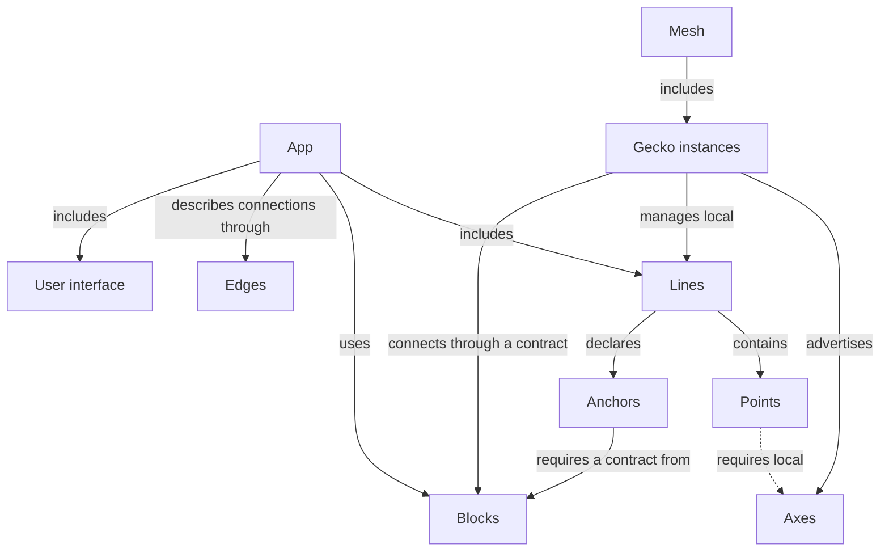

# Gecko — Concept Map

Version 0.3 · October 5, 2026 · [Русский](concepts.ru.md)

This document establishes a shared vocabulary for designing the first versions of Gecko. The concepts describe devices, concrete execution of processing chains, supported connections, and dependencies on shared services. API formats, configuration formats, and concrete implementation mechanisms will be chosen separately.

The sources are the conversations [“Gecko and Kubernetes Comparison”](https://chatgpt.com/g/g-p-6a1ac79a34548191ac02427895e5a00f/c/6ac20d5b-1eb4-83eb-8543-d13148c2f8e1), [“Pipeline Architecture”](https://chatgpt.com/c/6ac273bd-a1c0-83eb-8759-4d3000c859d8), and subsequent vocabulary refinements in this chat. A Line defines a concrete execution unit; a Point denotes a logical group within a Line; a Block implements a domain contract, and an Anchor explicitly describes a Line’s dependency on it.

**Status:** an agreed working framework for design. It does not describe implemented capabilities. Automatic placement, migration, load balancing, and seamless failover remain possible directions for future development.

## 1. Core Idea

A Gecko instance runs on a particular device, advertises available Axes, and manages Lines placed on it. Gecko instances that can reach one another form a Mesh.

An App combines Lines, supported processing connections, dependencies on Blocks, and a user interface. A Line consists of Points and executes in one dedicated process with the Gecko runtime. A Block is a shared service implementing a domain contract understood by Gecko. An Anchor defines a particular Line’s dependency on that service.

```text
App: inspection

Line front_camera ── Anchor detector ──→ Block inference
Line back_camera  ── Anchor detector ──→ Block inference

Inside front_camera (connections use supported Edges):
Source Point → Inference Point → Tracking Point → Output Point
```

An App describes the overall system. A Line defines a concrete execution boundary, and Points describe its internal functional structure. A Block denotes a provider of a service capability; an Anchor denotes a Line’s requirements for it. This does not imply ownership of the Block’s process.

## 2. Nine Core Terms

| Term | Definition | Practical Boundary |
|---|---|---|
| **Gecko** | A running runtime instance on a particular machine or device. | Advertises capabilities, manages local Lines, and connects Blocks through known contracts. |
| **Mesh** | A collection of Gecko instances that have discovered one another and can interact. | The available environment; a new participant does not automatically rebuild an App. |
| **App** | A composition of Lines, their Edges and Anchors, the Blocks they use, and a user interface that serves a task. | Can span several Gecko instances; has explicit membership and dependencies. |
| **Line** | A named processing chain of Points with shared configuration, lifecycle, and diagnostics. | A concrete execution unit: one dedicated process with the Gecko runtime on one Gecko instance. |
| **Point** | An addressable logical processing group within a Line. | Has interfaces, parameters, results, and metrics; this does not imply an independent process or restart. |
| **Block** | A shared service implementing a domain contract understood by Gecko. | Can serve several Lines; a process, container, or external service is an implementation choice, not the definition of a Block. |
| **Anchor** | A Line’s dependency on a shared service, specifying the required contract and the conditions under which the Line can operate. | References a particular Block; records required capabilities, readiness conditions, and behavior when unavailable. |
| **Edge** | A supported way to connect processing interfaces, with defined rules and constraints. | Predetermines allowed connections between Points within a Line and exposed Line interfaces in an App; applied to particular participants during assembly. |
| **Axis** | An execution capability advertised by a Gecko instance. The plural is **Axes**. | Matched against local requirements of selected implementations; Block availability is checked through Anchors. |

“The Gecko project” refers to the whole system, while “a Gecko instance” refers to a particular runtime. A machine provides the environment for Gecko. This document does not constrain the number of instances on one machine.

The geometric names reflect structure: a Point is a functional point within a Line; a Line is a processing chain; a Block is a shared service unit; an Edge is a supported way to connect; an Anchor is a Line’s support from a service. The vocabulary uses Point. Dot is not introduced as a separate entity.

## 3. Structure and Execution Boundaries



A Line has an explicit boundary: one Gecko instance and one dedicated process with the Gecko runtime during execution. Placement applies to the whole Line. Its Points cannot independently move to other machines without changing the execution structure.

**One source → one Line is the default policy.** A source can be a camera, file, or another supported source. Multiple inputs within one Line are possible when that scenario is explicitly supported; this is not a commitment for the first version.

A Block has its own service boundary defined by its implementation. Sharing a Block does not merge Lines or change their restart boundaries. Gecko may manage service startup where supported, but does not impose a “one dedicated process” rule on every Block.

UI elements belong to the App’s interface. Slider, Button, and VideoView are not processing Points within a Line. They connect to accessible interfaces and parameters of Lines, their Points, and Blocks. The dedicated-process rule for a Line does not apply to each UI element.

## 4. A Line and Its Points

A Line is the main operational unit for processing: `start`, `stop`, `pause`, `resume`, `reload`, `restart`, state, health, and logs. Operation availability and exact semantics depend on the implementation.

A Point groups elements that implement one understandable function:

```text
Inference Point
├── preprocessing
├── inference client or local inference
└── postprocessing
```

A Point can be complex and composite, but remains within its Line. It does not hide additional independent Lines or Blocks. If its function uses a shared service, the dependency is declared through its Line’s Anchor and displayed explicitly.

| Point Property | Example |
|---|---|
| Inputs and outputs | Video input, detections output |
| Parameters | Model, threshold |
| Implementation requirements | A supported inference backend |
| Diagnostics | Latency, errors, input and output previews |

Point addressability allows changing `front_camera.detector.threshold` or inspecting its metrics. It does not imply an independent `restart(detector)`. A change may apply while running or require rebuilding or restarting the Line; this must be visible before applying it.

A Line and a GStreamer pipeline also describe different levels. A Line is a Gecko object with a stable name, lifecycle, and dedicated process with the Gecko runtime; a GStreamer pipeline is a concrete implementation of its processing within that runtime. They may correspond directly in the first scenarios.

## 5. Blocks and Anchors: Shared Services and Dependencies

**A Block provides a domain capability; an Anchor describes a Line’s dependency on that provider.** For example, an inference Block executes models, while a recording storage Block writes and reads video segments by camera and time. An arbitrary process or database nearby does not become a Block merely by exposing a port.

A Block’s contract describes available operations, inputs and results, request/response correlation, errors, and available diagnostics. For inference, it must expose models and versions, their inputs and outputs, invocation rules, and handling of overload or timeout. The exact contract format will be selected separately.

```text
Line front_camera ── Anchor detector ──→ Block inference
Line back_camera  ── Anchor detector ──→ Block inference

Anchor detector:
  required contract: inference
  required capability: selected model and version
  readiness: service reachable, contract compatible, model ready
  behavior when unavailable: explicitly selected Line policy
```

Each Line has its own Inference Point that prepares requests and receives responses. A Point uses a Block through the Line’s declared Anchor; configuration shows which Points use that dependency. The Anchor itself is not a transport: calls are implemented by a contract client or adapter. A Line can have several Anchors, and several Lines can have Anchors referencing one Block.

A Block is connected explicitly: specify its name, contract and version, address, and a supported connection implementation. For a third-party service such as Triton, an adapter translates its interface into a Gecko contract, checks compatibility, and discovers available capabilities. A service built for Gecko can implement the contract directly. A process, container, or open port does not replace this validation.

**Zenoh is not mandatory for a Block.** A supported way to fulfill the contract is mandatory. An external service can use its own protocol through an adapter. Future discovery may locate service declarations, but does not create Anchors by itself.

Startup management and contract fulfillment are separate:

- **External service:** Gecko connects to an existing Block and does not have to own its process or provide restart operations.
- **Service managed by Gecko:** Gecko may start and stop the Block implementation through a supported mechanism. Concrete startup mechanisms will be selected separately.

Restarting a Line does not by itself restart a shared Block. A Block failure can affect all dependent Lines; each Line’s reaction is defined by its Anchors. Declared Blocks and Anchors remain in the App when a service is unavailable. Contract compatibility, service availability, and readiness of the required capability are displayed separately. An Anchor does not imply exclusive ownership of a Block.

## 6. Edges: Supported Processing Connections

**An Edge predetermines a supported way to connect processing interfaces.** It defines interface compatibility, the data transfer mechanism, and constraints. When assembling a Line or App, that mechanism is applied to one particular output and one particular input. Multiple such connections can form a many-to-many topology.

Within a Line, Edges define allowed Point connections implemented by the Gecko runtime. At App level, they define allowed connections between exposed Line interfaces. For example, `front_camera.video` may expose a selected video output of its Source Point. An external connection does not change the Point’s membership in its Line.

An element has inputs and outputs, but matching data types alone does not permit a connection: a supported Edge must exist. This lets the Editor show allowed connections and explain constraints before execution. Fan-out, multiple senders to one input, and stream mixing require explicit support.

| Context | What the Edge Must Support |
|---|---|
| Between Points in one Line | Implementation compatibility within the shared chain and process |
| Between Lines on one Gecko instance | A concrete interprocess data transfer mechanism |
| Between Lines on different Gecko instances | A concrete network path, formats, and transfer conditions |

`unsupported connection` is a valid validation result. Distinguish supported; unsupported; supported but conditions are unsuitable; and not yet checked. Available Axes do not guarantee a connection. The status of a particular connection is diagnostic information, not the definition of an Edge.

A Line’s dependency on a Block is described by an Anchor. Checks such as “is Triton reachable?” and “is the model ready?” belong to the Block and Anchor. Block calls are implemented by a domain contract client or adapter; they do not need to be represented as Edges.

Zenoh is considered for discovery, state, control, and suitable data. RTSP/RTP was considered for video between machines. Universal transfer of every Edge through Zenoh is not assumed. Bandwidth and latency measurements are tied to their time and test conditions.

## 7. Who Advertises Axes

**Gecko advertises Axes.** Points describe the local requirements of their selected implementations. A Line’s requirements combine those of its Points and internal Edges; placement validation considers the whole Line. If Gecko manages a Block’s startup, local requirements of that implementation are checked separately. A Line’s domain requirements for a Block are described by Anchors, not Axes.

```text
Gecko jetson-01 advertises: camera, gstreamer, tensorrt
Gecko desktop-01 advertises: ui.slider, ui.video_view

Inference Point requires: a supported inference backend
Line camera_front requires: capabilities for all its Points
```

Requirements belong to a particular implementation. An Inference Point with a local model and an Inference Point using a Block through an Anchor may have different local requirements. A remote Block does not turn its GPU into a local Axis of another Gecko instance.

Capability and current resource availability are distinct: having TensorRT does not confirm free GPU memory, and having a camera does not confirm access at launch. Resources, Anchor conditions, and Edge support are checked separately.

## 8. Process and Concrete Line Execution

Process is not part of the core domain vocabulary, but a Line’s execution boundary is concrete:

```text
1 running Line → 1 dedicated OS Process with the Gecko runtime
```

The runtime executes Points and supported connections within the Line. A Line retains its identity across restarts; the PID changes. Configuration and diagnostics belong to the stable name, while the PID is shown as technical information.

```text
Line camera_front → PID 1234
       restart
Line camera_front → PID 5678
```

`pause` means suspending processing according to runtime rules, rather than necessarily suspending the process through the OS. `reload` means applying configuration and may require a restart. These operations do not promise seamless application of every change.

A Block has no universal process-count rule or mandatory Gecko runtime. Its contract can be fulfilled by a service in a process, container, or external environment. A connected Block’s stable name does not depend on the PID of its implementation.

The dedicated-process rule for a Line does not describe the internals of the Gecko instance itself or desktop UI. Process isolation also does not remove shared dependencies on devices and services.

## 9. Placement, Distributed Processing, and UX

An App can run across several Gecko instances. Each Line is placed entirely on one Gecko instance. Moving a Point’s function beyond its Line requires an explicit structural change: using a Block’s service contract through an Anchor, or extracting part of the processing into another Line with a supported Edge.

```text
jetson-01                         gpu-01
Line capture ── video Edge ───→ Line analysis

or:
Line camera ── Anchor detector ──→ Block inference
```

The first case requires processing connection support. The second requires a contract, connection implementation, and fulfillment of Anchor conditions. A Block’s location is determined by its deployment; Gecko may support managing that deployment, but this does not follow from the Block’s role.

One App does not imply a shared process or one atomic pause: an App operation coordinates its participants according to a chosen policy. A shared Block should not automatically stop if other applications use it.

The Editor shows an App with Lines, connections through Edges, and dependencies through Anchors referencing Blocks. Expanding a Line reveals its Points. Lifecycle and placement are available at Line level; parameters and diagnostics are available at Point level. An Anchor shows its required contract, referenced Block, readiness, and policy for unavailability. A Block shows its capabilities, state, and available management operations. Required restarts are visible before changes; dependent consumers are visible before restarting a Block.

A desktop participating in an App is also a Gecko instance with UI Axes. Admin / Editor and the operator screen are interface roles. An operator can see only video and the necessary controls. Administrator permissions do not follow from having a UI Axis.

## 10. Workflow for Early Versions

1. Start Gecko on available devices; discover Mesh participants and their Axes.
2. Create an App and Lines; assemble Points within Lines.
3. Select supported Edges for particular Point connections and exposed Line interfaces; connect the user interface to data and controls.
4. Explicitly connect the required Blocks through contracts and declare Line Anchors: capabilities, readiness conditions, and behavior when unavailable.
5. Select a Gecko instance for each Line. Where Block startup management is supported, specify its deployment separately.
6. Check local requirements, resources, every Edge, and every Anchor’s conditions; explain limitations before launch.
7. Start Lines and, where necessary and supported, services. Show Line and Block state, Anchor readiness, and Point diagnostics.
8. Apply changes with their scope clearly identified: a Point parameter, a Line restart, an Anchor change, or a Block operation.

Manual placement is sufficient for the first version. Discovery alone does not connect participants or rebuild an App. The initial practical scenario is one camera or file, one Line, and one dedicated process; shared inference is added as a Block with an explicitly declared Anchor.

## 11. Vocabulary Changes

### From Version 0.2 to 0.3

| Previously | Now |
|---|---|
| Lines and Blocks are symmetric managed execution units | A Line is a concrete process with the Gecko runtime; a Block is a service fulfilling a domain contract |
| A managed Block must have one dedicated process | Block execution is implementation-defined; startup management is separate from the contract |
| Service dependencies have no term of their own | An Anchor explicitly describes a Line’s dependency on a Block, its requirements, and operating conditions |
| An Edge is a logical connection, including connections to Blocks | An Edge defines a supported way to connect processing between Points or Lines; Block dependencies are described by Anchors |
| External service connection has no explicit contract validation | A Block is connected explicitly through a direct contract implementation or adapter; Zenoh is not mandatory |

### Retained Changes in Version 0.2 from 0.1

An App combines Lines and UI rather than an arbitrary graph of Points. A Point is a logical group within a Line; a Line is the placement and lifecycle unit. Process is an execution mechanism and diagnostic detail.

Earlier names Component / Dot correspond to Point only in the context of internal Line processing. Capability corresponds to Axis. Earlier Connection denoted a particular connection; a supported Edge is now selected for it. Qualify “node”: Gecko is a runtime instance; Point is an element within a Line.

The Kubernetes comparison retains its original meaning: Gecko understands media/AI processing, supported connections, and domain dependencies. Kubernetes can provide an execution environment for part of the system. This map does not establish a direct correspondence between a Line or Block and a Pod.

## 12. Open Questions

- Configuration and interface formats, their versions, and identity.
- Rules for exposing Point interfaces through a Line; the distinction between parameters and control inputs.
- Concrete Point and Edge implementations for the first version.
- The first Block domain contract (inference), its direct implementations, and the Triton adapter.
- Anchor format, binding of Points that use Anchors, and concrete policies for service unavailability or lack of readiness.
- Pause/reload semantics, policy for loss of a source or desktop, and the order of App operations.
- Shared Block ownership, access by multiple Apps, control permissions, and supported service startup mechanisms.
- When automatic placement, migration, load balancing, and recovery are needed.

These questions refine implementation while preserving the foundation: Gecko executes Lines; Points organize processing within a Line; Edges define supported connections; Blocks fulfill domain contracts; Anchors describe Line dependencies on them; Axes describe local Gecko capabilities.
