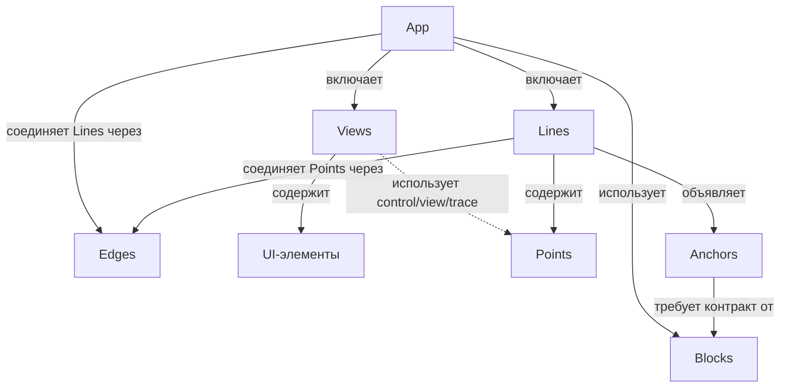
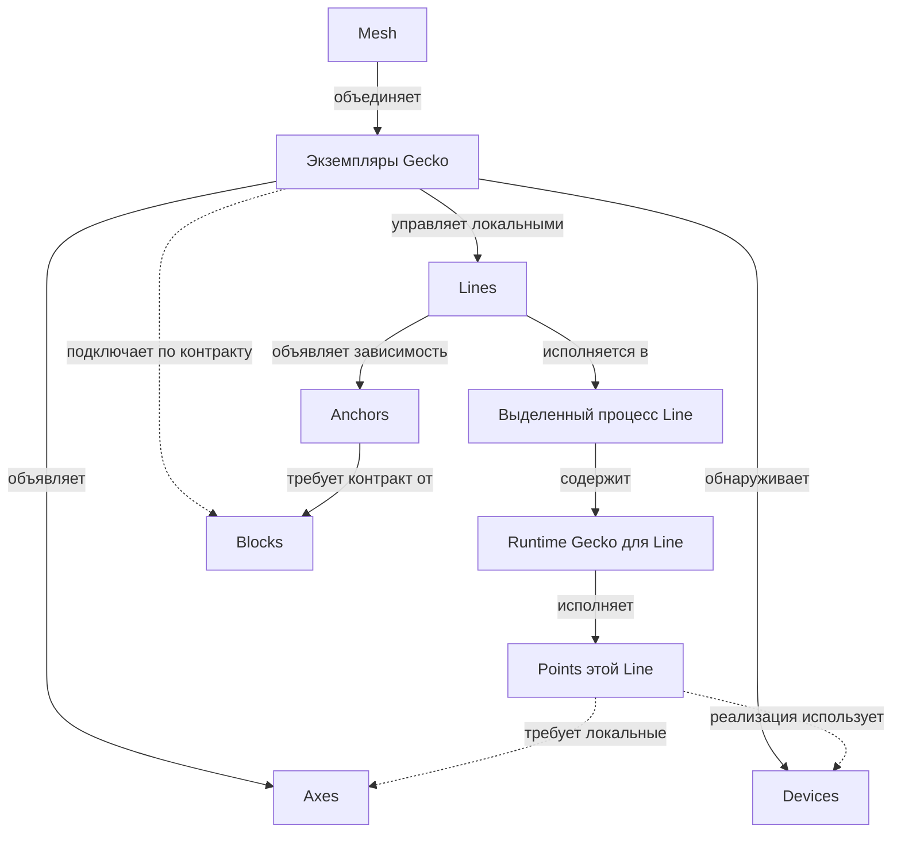

# Gecko — карта понятий

Версия 0.5 · 8 октября 2026 года · [English](concepts.md)

Этот документ задаёт общий язык для проектирования первых версий Gecko. Понятия описывают устройства, конкретное исполнение цепочек обработки, поддержанные соединения и зависимости от общих сервисов. Форматы API, конфигурации и конкретные механизмы реализации будут выбраны отдельно.

Основа — обсуждения [«Сравнение Gecko и Kubernetes»](https://chatgpt.com/g/g-p-6a1ac79a34548191ac02427895e5a00f/c/6ac20d5b-1eb4-83eb-8543-d13148c2f8e1), [«Архитектура пайплайна»](https://chatgpt.com/c/6ac273bd-a1c0-83eb-8759-4d3000c859d8) и последующее уточнение словаря в этом чате. Line задаёт конкретную единицу исполнения; Point обозначает логическую группу внутри Line; Block определяется предметным контрактом, а Anchor явно описывает зависимость Line от его поставщика. Device обозначает оборудование, на котором исполняются выбранные реализации.

**Статус:** согласованный рабочий каркас для проектирования. Он не описывает уже реализованные возможности. Обнаружение возможностей, автоматическая проверка соединений, предложение композиции App и подготовка известных сервисов входят в целевой UX. Конкретный объём первой версии выбирается отдельно; автоматическая миграция работающих участников, балансировка и бесшовный failover не следуют из этого workflow.

## 1. Основная идея

Пользователь запускает экземпляры Gecko на доступных машинах и платформах. Каждый Gecko обнаруживает доступные Devices, объявляет Axes, известные реализации обработки и подключённые сервисы. Доступные друг другу экземпляры Gecko образуют Mesh; поддержанные проверки соединений дают сведения о пропускной способности и задержке.

Под задачу Gecko предлагает варианты состава и размещения обработки с учётом возможностей Mesh. App — описание и представление выбранной композиции: Lines, поддержанных соединений, зависимостей от Blocks и Views. Это не заранее заданная отдельная программа. Выбранный вариант имеет явную конфигурацию и может сохраняться, проверяться и запускаться. Line состоит из Points и исполняется в одном выделенном процессе с runtime Gecko. Block определяется понятным Gecko предметным контрактом; сервис, удовлетворяющий этому контракту, подключается как Block. Anchor задаёт зависимость конкретной Line от такого поставщика. View представляет выбранные данные, управление и диагностику App пользователю.

```text
App: inspection

Line front_camera ── Anchor detector ──→ Block inference
Line back_camera  ── Anchor detector ──→ Block inference

Внутри front_camera (соединения реализованы через поддержанные Edges):
Source Point → Inference Point → Tracking Point → Output Point
```

App описывает состав и связи Lines, их Points и используемых Blocks для конкретной прикладной задачи. Line задаёт конкретную границу исполнения, Points — её внутреннюю функциональную структуру. Контракт Block и конкретный поставщик этого контракта различаются. Контейнер, внешний сервис или gecko-native реализация могут стать поставщиками одного контракта; Block не задаёт способ их развёртывания и владение процессом.

## 2. Одиннадцать основных терминов

| Термин | Определение | Практическая граница |
|---|---|---|
| **Gecko** | Запущенный экземпляр runtime на конкретной машине или платформе. | Обнаруживает Devices, объявляет возможности, управляет локальными Lines и подключает Blocks по контрактам; может поддерживать подготовку известных сервисов. |
| **Mesh** | Совокупность Gecko, которые обнаружили друг друга и могут взаимодействовать. | Основа для проверки связей и предложения вариантов App; появление участника не меняет работающую композицию само по себе. |
| **App** | Описание и представление композиции Lines, их Edges и Anchors, используемых Blocks и Views для решения задачи. | Может быть предложено автоматически из возможностей Mesh; выбранный вариант фиксирует состав, реализации, размещение и зависимости. |
| **Line** | Именованная цепочка обработки из Points с общей конфигурацией, жизненным циклом и диагностикой. | Конкретная единица исполнения: один выделенный процесс с runtime Gecko на одном Gecko. |
| **Point** | Адресуемая логическая группа обработки внутри Line. | Объявляет интерфейсы обработки и возможности control/view/trace; самостоятельный процесс или перезапуск из этого не следует. |
| **View** | Пользовательское представление App, объединяющее отображение данных, состояния и доступные пользователю действия. | Состоит из внешних UI-элементов с явными привязками к объявленным возможностям App; само понятие не задаёт отдельного процесса. |
| **Block** | Предметная сервисная возможность, определяемая контрактом Gecko. | Конкретный сервис подключается как Block после проверки контракта; требования к железу и способ запуска принадлежат реализации поставщика. Может обслуживать несколько Lines. |
| **Anchor** | Зависимость Line от общего сервиса, задающая требуемый контракт и условия, при которых Line может работать. | Ссылается на конкретный Block; фиксирует нужные возможности, условия готовности и поведение при недоступности. |
| **Edge** | Поддержанный способ соединения интерфейсов обработки с заданными правилами и ограничениями. | Заранее определяет допустимые связи между Points внутри Line и между выставленными интерфейсами Lines в App; применяется к конкретным участникам при сборке. |
| **Axis** | Возможность среды исполнения, которую объявляет Gecko. Множественное число — **Axes**. | Сопоставляется с локальными требованиями выбранных реализаций; доступность Block проверяется через Anchors. |
| **Device** | Адресуемая аппаратная единица исполнения, доступная конкретному Gecko. | CPU, GPU или другой ускоритель с характеристиками, внутренней структурой, ресурсами и состоянием; не является Block или Axis. |

«Проект Gecko» означает систему целиком, а «экземпляр Gecko» — конкретный runtime. Машина предоставляет окружение для Gecko. Число экземпляров на одной машине этот документ не ограничивает.

Геометрические названия отражают структуру: Point — функциональная точка внутри Line; Line — цепочка обработки; Block — сервисная возможность по контракту; Edge — поддержанный способ соединения; Anchor — опора Line на сервис; View — проекция App для пользователя. Для оборудования используется привычное название Device без геометрического переименования. В словаре используется Point. Dot не вводится как отдельная сущность.

## 3. Структура и границы исполнения

### 3.1. Состав App

Эта схема описывает состав приложения и связи понятий. Edges задают соединения Points внутри Line и соединения Lines на уровне App; Anchors описывают зависимости от Blocks.



UI-элементы принадлежат Views App. Slider, Button и VideoView не считаются Points обработки внутри Line. Они связываются с объявленными возможностями Lines, их Points и Blocks. Требование отдельного процесса для Line не распространяется на View или каждый UI-элемент.

### 3.2. Среда и границы исполнения

Эта схема описывает размещение и исполнение. App может охватывать несколько Gecko; конкретная Line целиком исполняется на одном из них. Подключение Block по контракту не означает размещения его процесса на этом Gecko.



Line имеет явную границу: один Gecko и один выделенный процесс с runtime Gecko при исполнении. Размещается Line целиком. Points внутри неё нельзя независимо переносить на другие машины без изменения структуры исполнения.

**Один источник → одна Line — политика по умолчанию.** Источником может быть камера, файл или другой поддержанный источник. Несколько входов в одной Line возможны при явной поддержке такого сценария; это не обязательство первой версии.

Block имеет собственную границу сервиса, которую задаёт его реализация. Общий Block не объединяет Lines и не меняет их границы перезапуска. Gecko может управлять запуском сервиса, если это поддержано, но не устанавливает для каждого Block правило «один выделенный процесс».

## 4. Line и её Points

Line — основная единица эксплуатации обработки: `start`, `stop`, `pause`, `resume`, `reload`, `restart`, состояние, health и логи. Доступность и точная семантика операций зависят от реализации.

Point группирует элементы, реализующие одну понятную функцию:

```text
Inference Point
├── preprocessing
├── inference client или локальный inference
└── postprocessing
```

Point может быть сложным и составным, но остаётся внутри своей Line. Он не скрывает дополнительные самостоятельные Lines или Blocks. Если функция использует общий сервис, зависимость объявляется через Anchor её Line и отображается явно.

| Свойство Point | Пример |
|---|---|
| Входы и выходы | Видео на входе, detections на выходе |
| Параметры | Модель, threshold |
| Требования реализации | Поддерживаемый inference backend |
| Диагностика | Latency, ошибки, preview входа и выхода |

Адресуемость Point позволяет изменить `front_camera.detector.threshold` или посмотреть его метрики. Она не означает независимый `restart(detector)`. Изменение может применяться во время работы либо требовать перестройки или перезапуска Line; это должно быть видно до применения.

Line и GStreamer pipeline тоже имеют разные уровни описания. Line — объект Gecko со стабильным именем, жизненным циклом и выделенным процессом с runtime Gecko; GStreamer pipeline — конкретная реализация её обработки внутри этого runtime. Для первых сценариев они могут соответствовать друг другу напрямую.

### 4.1. Контракт Point: control, view и trace

**Управление, представление данных и трассировка проектируются одновременно с обработкой.** Point объявляет свои возможности так, чтобы внешний UI мог узнать, что доступно и какие элементы можно привязать. Эти описания входят в контракт Point с первой версии; конкретные наборы возможностей зависят от реализации.

| Часть контракта | Что объявляет Point | Возможные внешние UI-элементы |
|---|---|---|
| **Control plane** | Параметры, типы, диапазоны или варианты выбора, доступные команды, условия применения и подтверждение результата | Slider, поле ввода, список моделей, кнопка действия |
| **View plane** | Доступные представления данных, их форматы и смысл: preview, изображения, detections, таблицы | VideoView, просмотр изображения, overlay, таблица результатов |
| **Trace plane** | События обработки, ошибки, длительности, метрики и идентификаторы для связи событий с входами и результатами | Timeline, график latency, просмотр пути кадра или запроса |

View как объект App и view plane различаются: plane объявляет доступные представления данных, а View собирает пользовательский экран из возможностей всех трёх planes.

Control plane описывает, доступно ли изменение во время работы, требует ли оно перестройки или перезапуска Line и когда считается применённым. Команды Point не вводят независимый lifecycle: `restart(detector)` не появляется автоматически. Операции жизненного цикла принадлежат Line.

View plane описывает доступные представления, а не готовый экран. Point может предложить предпочтительный UI-элемент, например Slider для числового параметра или overlay для detections; View выбирает конкретное оформление. Форматы и координатные системы должны позволять проверить привязку, например совместимость detections с отображаемым изображением.

Trace plane связывает события с конкретной Line, Point и обрабатываемым кадром или запросом. При переходе между Points и Lines контракт должен позволять сохранять связь событий. Совокупность разрозненных логов без такой связи не заменяет trace. Полнота сбора, sampling и хранение истории будут определены отдельно.

```text
Inference Point detector

Control:
  threshold: число 0…1, изменение во время работы
  model: выбор из списка, изменение требует перезапуска Line

View:
  input_preview: изображение
  detections: результаты с координатами и идентификатором кадра

Trace:
  inference_started / completed / failed
  duration, frame_id / request_id
```

Это пример контракта, а не универсальное требование к каждой реализации inference. Point объявляет возможности; runtime Line обеспечивает доступ к ним; внешний View отображает данные и выполняет разрешённые действия. В конфигурации сохраняются явные привязки UI к адресам параметров, команд и представлений. Эти привязки не являются Edges обработки или Anchors сервисных зависимостей. Форматы API и транспорты этих planes пока не выбраны.

### 4.2. Выбор реализации Point

Функция и контракт Point отличаются от способа исполнения. Например, Inference Point может иметь реализации для CPU, NVIDIA dGPU, платформы Jetson или обращения к inference Block через Anchor. Это альтернативы с собственными условиями, а не плоский список взаимозаменяемых устройств. Варианты должны удовлетворять нужному контракту Point; их совместимость с соседними Points и Edges проверяется отдельно.

При построении App механизм подбора выбирает совместимые реализации и размещение Line целиком из известных вариантов, с учётом задачи, ограничений и пользовательских предпочтений. App сохраняет выбранный вариант или явно разрешённую политику выбора. Gecko проверяет конфигурацию и привязывает исполнение к конкретным Devices. Пользователь может выбрать вариант вручную или зафиксировать реализацию и размещение.

Собственные требования Line, например поддерживаемая архитектура её runtime, действуют одновременно с требованиями Points и внутренних Edges. Поддержка runtime на x86_64 и arm64 не означает, что любой состав Line совместим с обеими архитектурами. Переход от локального inference к Block меняет структуру зависимостей и требует Anchor; автоматическое переключение во время работы не следует из подбора перед запуском.

## 5. Block и Anchor: общие сервисы и зависимости

**Block определяется предметным контрактом, Anchor — зависимость Line от поставщика этого контракта.** Например, контракт inference описывает выполнение моделей, а контракт хранения записей — запись и чтение фрагментов видео по камере и времени. Работающий сервис, контейнер или gecko-native реализация становится подключённым Block, когда удовлетворяет контракту. Произвольный процесс или база данных рядом не становится Block только благодаря доступному порту.

Контракт Block описывает доступные операции, входы и результаты, сопоставление запросов и ответов, ошибки и доступную диагностику. Для inference он должен позволять узнать модели и версии, их входы и выходы, правила вызова и обработки перегрузки или таймаута. Точный формат контракта будет выбран отдельно.

```text
Line front_camera ── Anchor detector ──→ Block inference
Line back_camera  ── Anchor detector ──→ Block inference

Anchor detector:
  требуемый контракт: inference
  нужная возможность: выбранная модель и версия
  готовность: сервис доступен, контракт совместим, модель готова
  поведение при недоступности: явно выбранная политика Line
```

У каждой Line свой Inference Point, который готовит запросы и принимает ответы. Point использует Block через объявленный Anchor Line; в конфигурации видно, какие Points используют эту зависимость. Сам Anchor не является транспортом: вызовы реализуются клиентом или адаптером контракта. Одна Line может иметь несколько Anchors, а несколько Lines — Anchors на один Block.

Привязка к поставщику Block сохраняется явно: имя сервиса, контракт и версия, адрес или встроенная привязка и поддержанная реализация подключения. Её может предложить механизм построения App или задать пользователь. Для стороннего сервиса, например Triton, адаптер переводит его интерфейс в контракт Gecko, проверяет совместимость и выясняет доступные возможности. Собственный сервис может реализовывать контракт напрямую. Наличие процесса, контейнера или открытого порта не заменяет такую проверку.

Обязателен поддержанный способ выполнения контракта. Внешний сервис может использовать свой протокол через адаптер. Обнаруженные объявления сервисов участвуют в построении вариантов App; привязки Anchors фиксируются в выбранной композиции, а не возникают только из факта обнаружения.

Перезапуск Line сам по себе не перезапускает общий Block. Отказ Block может затронуть все зависимые Lines; реакция каждой определяется её Anchors. Объявленный Block и Anchors остаются в App при недоступности сервиса. Совместимость контракта, доступность сервиса и готовность нужной возможности показываются отдельно. Anchor не означает исключительного владения Block.

### 5.1. Доступный поставщик и возможность его подготовить

Контракт Block не требует конкретного CPU, GPU или контейнера. Такие требования принадлежат реализации поставщика. Нода различает работающий поставщик контракта и известную реализацию, которую можно подготовить. Наличие подходящего железа само по себе не означает ни готового Block, ни возможности его автоматического запуска.

| Состояние | Условие | Как показывается в варианте App |
|---|---|---|
| Доступен сейчас | Поставщик подключён, контракт совместим, нужная возможность готова | Можно использовать после проверки Anchor |
| Можно подготовить | Известны реализация, её требования и поддержанный механизм подготовки | Требуется подготовка с видимыми шагами и результатом |
| Требуется внешняя подготовка | Поставщик нужен, но Gecko не умеет его подготовить | Зависимость не удовлетворена; объясняется недостающее условие |

Реализация может сообщать backend, используемые Devices, расположение и причины неготовности. Эти сведения позволяют показать аппаратную зависимость поставщика, не перенося её в контракт Block. Неизвестные сведения об оборудовании внешнего сервиса отмечаются как неизвестные; Gecko не выводит их из имени сервиса или наличия локальной GPU.

### 5.2. Опциональное управление подготовкой и запуском

Подготовка сервисов — опциональная возможность Gecko, отдельная от контракта Block и композиции App. Подключение существующего сервиса не требует этой возможности. Для целевого UX «запустить ноды → выбрать задачу → получить работающий App» подготовка известных поставщиков должна проектироваться вместе с подбором композиции.

| Способ исполнения поставщика | Ответственность Gecko |
|---|---|
| Уже работающий внешний сервис | Подключиться, проверить контракт и готовность; управление процессом не предполагается |
| Отдельная программа или скрипт | Использовать известный механизм подготовки и запуска, затем проверить результат |
| Контейнер | Обратиться к поддержанному контейнерному runtime или внешнему менеджеру, затем проверить сервис |
| Gecko-native | Создать встроенный сервис по тому же контракту; исполнение внутри процесса Gecko или отдельным процессом определяется реализацией |

Для поддержанной реализации описываются требования, установка, параметры и артефакты (в том числе модели), запуск, проверка готовности, логи, остановка и очистка созданных ресурсов. Вызов скрипта сам по себе не является подтверждением готовности Block. UI показывает шаги подготовки, ошибки и требуемые действия в терминах сервиса. Для первой версии предпочтителен ограниченный набор известных реализаций с описанным жизненным циклом; поддержка произвольных скриптов и контейнеров не предполагается автоматически.

App сохраняет выбранного поставщика и, где необходимо, параметры его подготовки. Способ развёртывания не становится частью предметного контракта. Gecko не обязан реализовывать собственный контейнерный runtime, универсальный оркестратор, миграцию или балансировку. Встроенный поставщик разделяет ресурсы и риск отказа процесса Gecko; этот способ исполнения не даёт процессной изоляции Block.

Для созданного поставщика фиксируются владелец жизненного цикла и зависимые потребители. Остановка App не означает автоматическую остановку общего Block. Правила повторного использования, остановки и очистки должны учитывать другие Apps и Lines; ошибка подготовки не должна приводить к удалению внешнего сервиса, которым Gecko не владеет.

## 6. Edge: поддержанные соединения обработки

**Edge заранее задаёт поддержанный способ соединения интерфейсов обработки.** Он определяет совместимость интерфейсов, механизм передачи данных и ограничения. При сборке Line или App этот способ применяется к одному конкретному выходу и одному конкретному входу. Несколько таких соединений могут образовать many-to-many топологию.

Внутри Line Edges задают допустимые соединения Points, реализованные средствами runtime Gecko. На уровне App они задают допустимые соединения выставленных интерфейсов Lines. Например, `front_camera.video` может представлять выбранный видеовыход её Source Point. Внешняя связь не отменяет принадлежность Point своей Line.

У элемента есть входы и выходы, но совпадение типов данных само по себе не разрешает связь: должен существовать поддержанный Edge. Это позволяет редактору заранее показать допустимые соединения и объяснить ограничения. Разветвление, несколько отправителей на один вход и смешивание потоков требуют явной поддержки.

| Контекст | Что должен поддерживать Edge |
|---|---|
| Между Points одной Line | Совместимость реализаций внутри общей цепочки и процесса |
| Между Lines одного Gecko | Конкретный способ межпроцессной передачи данных |
| Между Lines разных Gecko | Конкретный сетевой путь, форматы и условия передачи |

`unsupported connection` — допустимый результат проверки. Отдельно различаются: поддерживается; не поддерживается; поддерживается, но условия не подходят; ещё не проверено. Наличие Axes не гарантирует соединение. Статус конкретного соединения — диагностика, а не определение Edge.

Зависимость Line от Block описывается Anchor. Проверки «доступен ли Triton?» и «готова ли модель?» относятся к Block и Anchor. Вызовы Block реализуются клиентом или адаптером предметного контракта; они не требуют представления как Edge.

Конкретные транспорты выбираются отдельно для поддержанных способов соединения. Измерения bandwidth и latency привязаны ко времени и условиям проверки.

## 7. Axes, Devices и требования исполнения

**Axes объявляет Gecko.** Device описывает конкретное оборудование, Axis — доступную возможность среды с учётом оборудования, программного окружения и доступа. Points описывают локальные требования выбранной реализации. Собственные требования Line и требования её Points и внутренних Edges проверяются одновременно; при размещении проверяется Line целиком. Если Gecko готовит поставщика Block, требования его реализации проверяются отдельно в месте его исполнения. Предметные требования Line к Block описываются Anchors, а не Axes.

```text
Gecko jetson-01 объявляет: camera, gstreamer, tensorrt
Gecko desktop-01 объявляет: ui.slider, ui.video_view

Inference Point требует: поддерживаемый inference backend
Line camera_front требует: возможности для всех её Points
```

Требование относится к конкретной реализации. Inference Point с локальной моделью и Inference Point, использующий Block через Anchor, могут иметь разные локальные требования. Наличие удалённого Block не превращает его GPU в локальную Axis другого Gecko.

Capability и текущая доступность ресурсов различаются: наличие TensorRT не подтверждает свободную GPU-память, а наличие камеры — доступ к ней при запуске. Ресурсы, условия Anchors и поддержка Edges проверяются отдельно.

### 7.1. Device и его внутренние ресурсы

Device — CPU, дискретная или встроенная GPU, NPU или другой аппаратный ускоритель, который Gecko отдельно идентифицирует и выбирает для исполнения. ARM/x86 — характеристики архитектуры CPU, а Jetson или embedded-плата — платформы с доступными на них Devices. Для первой версии CPU можно представлять одним Device на машине, описывая ядра и логические CPU внутри; детализация сокетов и NUMA выбирается при необходимости.

```text
Gecko jetson-01
├── платформа: Jetson
├── Device cpu-0: архитектура arm64, ядра и логические CPU
├── Device gpu-0: характеристики, память, состояние
└── Axes: проверенные доступные возможности исполнения
```

Каждое ядро CPU не становится отдельным Device. Ядра, потоки, память и другие внутренние ресурсы учитываются при размещении и исполнении. Affinity, quota и исключительное резервирование — разные условия; привязка к логическим CPU сама по себе не означает их эксклюзивного выделения. Конкретные механизмы распределения ресурсов выбираются отдельно.

Одна Line может использовать несколько Devices, например CPU для подготовки данных и GPU для inference, сохраняя один процесс на одном Gecko. Физическое наличие Device не гарантирует доступную Axis: нужны совместимое программное окружение и фактический доступ. При нескольких экземплярах Gecko на одной машине оборудование может быть общим; объявления нод не означают независимые запасы ресурсов.

### 7.2. Граф зависимостей App

Состав App можно раскрывать как дерево, но зависимости исполнения образуют граф: несколько Lines могут использовать один Block или Device. Проверка App объединяет результаты участников, сохраняя место исполнения каждой зависимости.

```text
App inspection
├── Line camera: собственные требования runtime
│   ├── Source Point: требования реализации
│   ├── Inference Point: требования выбранного варианта
│   │   └── локальная привязка к Device gpu-0
│   └── внутренние Edges: требования совместимости и ресурсов
└── Line archive
    └── Anchor storage → Block recordings
                          └── поставщик: отдельные требования реализации
```

Line получает совокупность собственных требований, требований Points и внутренних Edges. При использовании Block Line требует контракт и готовность через Anchor; аппаратные требования удалённого поставщика не становятся локальными требованиями Line. В общей диагностике можно раскрыть сообщённые поставщиком связи с Devices. Дополнительный термин для аппаратной зависимости не вводится: требования и конкретные привязки входят в конфигурацию исполнения.

## 8. Process и конкретное исполнение Line

Process не входит в основной предметный словарь, но граница исполнения Line конкретна:

```text
1 запущенная Line → 1 выделенный OS Process с runtime Gecko
```

Runtime исполняет Points и поддержанные соединения внутри Line. Line сохраняет свою идентичность при перезапуске; PID меняется. Конфигурация и диагностика относятся к устойчивому имени, а PID показывается как техническая информация.

```text
Line camera_front → PID 1234
       restart
Line camera_front → PID 5678
```

`pause` означает приостановку обработки по правилам runtime, а не обязательно остановку процесса средствами ОС. `reload` означает применение конфигурации и может потребовать перезапуска. Эти операции не обещают бесшовность любого изменения.

Для Block нет общего правила числа процессов или обязательного runtime Gecko. Его контракт может выполнять внешний сервис, программа, контейнер или gecko-native сервис, в том числе внутри процесса Gecko. Стабильное имя подключённого Block не зависит от PID его реализации.

Правило выделенного процесса Line не описывает устройство самого экземпляра Gecko или desktop UI. Изоляция процессов также не устраняет общие зависимости от устройств и сервисов.

## 9. Размещение, распределённая обработка и UX

Admin / Editor показывает возможности Mesh и предлагает под задачу совместимые варианты App, включая реализации Points, размещение Lines и поставщиков Blocks. Доступное сейчас отличается от требующего подготовки и от неудовлетворённой зависимости. Выбор варианта фиксирует композицию; ручная сборка и изменение ограничений также доступны.

Ноды автоматически выполняют поддержанные проверки путей между собой для оценки bandwidth и latency. Планирование учитывает требования потока и актуальность измерений; непроверенный путь не считается гарантированно подходящим. Измерение одного соединения не гарантирует пропускную способность всех потоков одновременно и не резервирует ресурсы. Перед запуском повторно проверяются текущая доступность ресурсов и готовность зависимостей.

App может исполняться на нескольких Gecko. Каждая Line размещается целиком на одном Gecko. Вынос функции Point за границу Line требует явного изменения структуры: использования сервисного контракта Block через Anchor или выделения части обработки в другую Line с поддержанным Edge.

```text
jetson-01                         gpu-01
Line capture ── video Edge ───→ Line analysis

или:
Line camera ── Anchor detector ──→ Block inference
```

В первом случае проверяется поддержка соединения обработки. Во втором — контракт, реализация подключения и условия Anchor. Место исполнения Block определяется его развёртыванием; управление этим развёртыванием может быть доступно Gecko, но не следует из роли Block.

Единство App не означает общий процесс или единую атомарную паузу: операция над App координирует его участников по выбранной политике. Общий Block не должен автоматически останавливаться, если им пользуются другие приложения.

Editor показывает App с Lines, соединениями через Edges и зависимостями через Anchors на Blocks. Раскрытая Line показывает Points. На уровне Line доступны lifecycle и размещение; на уровне Point — параметры и диагностика. Для Anchor видны требуемый контракт, используемый Block, готовность и политика недоступности. Для Block видны возможности, состояние и доступные операции управления. Перед изменением видны требуемые перезапуски; перед перезапуском Block — зависимые потребители.

Desktop, участвующий в App, тоже является Gecko с UI Axes. Admin / Editor и операторский экран — роли интерфейса. Оператор может видеть только видео и нужные органы управления. Права администратора не следуют из наличия UI Axis.

### 9.1. View: пользовательское представление App

App может иметь несколько Views. View оператора показывает видео, detections и нужные органы управления. View диагностики показывает состояние Lines, готовность Anchors, метрики Points и trace событий. Оба используют объявленные возможности одного App.

View состоит из UI-элементов с явными привязками к данным, параметрам и командам. Например, VideoView отображает `front_camera.detector.input_preview`, Slider изменяет `front_camera.detector.threshold`, а Button вызывает `front_camera.start`. Trace-представление использует объявленные события и их идентификаторы.

Объявления позволяют собрать базовый View автоматически или создать специальный экран с теми же интерфейсами. UI учитывает доступность операций, подтверждение изменений, необходимость перезапуска и потерю связи; предпочтительный виджет не даёт дополнительных прав управления.

View исполняется вне обработки Points. Его определение не обещает отдельного процесса или конкретного UI framework. Размещение, доставка preview и trace, правила обновления и восстановления связи выбираются отдельно; доступный способ передачи данных должен поддерживать конкретную привязку.

## 10. Целевой workflow и первые версии

1. Запустить Gecko на доступных машинах и платформах; обнаружить участников Mesh, их Devices, Axes, известные реализации Points, работающих поставщиков Blocks и возможности подготовки сервисов.
2. Автоматически проверить поддержанные пути между нодами; сохранить bandwidth, latency, время и условия измерений.
3. Указать задачу, входы и ограничения. Получить варианты App с совместимыми реализациями Points, составом Lines, Edges, Anchors, поставщиками Blocks, Views и размещением.
4. Показать для каждого варианта, что готово сейчас, что требует подготовки и какие зависимости не удовлетворены. Пользователь выбирает вариант или меняет ограничения и состав; App сохраняет выбранную композицию и привязки.
5. Проверить совокупные требования каждой Line, доступность Devices и ресурсов, каждый Edge, условия Anchors и привязки Views. Объяснить ограничения до запуска.
6. Подготовить необходимых поставщиков поддержанными механизмами. Проверить их контракт и готовность нужных возможностей; внешняя подготовка остаётся явным условием, если Gecko не может её выполнить.
7. Повторно проверить готовность перед запуском Lines. Показать состояние Lines и Blocks, готовность Anchors, использование Devices, диагностику Points и ход подготовки сервисов.
8. Применять изменения с явным указанием их масштаба: параметр Point, смена реализации, перезапуск Line, изменение Anchor или операция над поставщиком Block. Изменение Mesh может дать новые предложения, но не перестраивает работающий App само по себе.

Это целевой сценарий, а не заявление о готовой реализации. Первые версии могут ограничить набор задач, реализаций и механизмов подготовки; ручной выбор остаётся доступным. Начальный практический сценарий — камера или файл и одна Line с локальной обработкой либо общий inference через Block. Обнаружение, построение вариантов, подготовка и исполнение — отдельные шаги; подбор перед запуском не обещает миграцию или failover во время работы.

## 11. Изменения словаря

### От версии 0.4 к 0.5

| Раньше | Теперь |
|---|---|
| Оборудование упоминается без адресуемой сущности | Device описывает CPU, GPU и ускорители; ядра и потоки остаются внутренними ресурсами |
| App сначала собирается вручную, затем размещается | App — композиция под задачу, предложенная из возможностей Mesh или собранная вручную |
| Автоматическое размещение оставлено будущему | Предложение реализаций и размещения до запуска входит в целевой UX; миграция и failover остаются отдельными задачами |
| Требования Line описаны через Points и Edges | Проверяются также собственные требования Line; зависимости App образуют граф |
| Контракт Block, поставщик и его запуск недостаточно разделены | Контракт задаёт сервисную возможность; требования к железу и подготовка принадлежат реализации поставщика |
| Подключение и запуск сервисов описаны в общих чертах | Различаются доступный Block, поставщик, которого можно подготовить, и внешняя подготовка; описаны внешние, программные, контейнерные и gecko-native варианты исполнения |

### От версии 0.3 к 0.4

| Раньше | Теперь |
|---|---|
| Пользовательский интерфейс App не имеет собственного термина | View — пользовательское представление App с явными UI-привязками |
| Point перечисляет параметры и диагностику без общего контракта для внешнего UI | Point сразу объявляет control/view/trace-возможности, условия использования и подходящие UI-элементы |
| Состав App и среда исполнения смешаны в одной схеме | Композиция App показана отдельно от размещения и исполнения |
| В тексте перечислены варианты транспорта | Выбор транспорта оставлен открытым |

### От версии 0.2 к 0.3

| Раньше | Теперь |
|---|---|
| Line и Block — симметричные управляемые единицы исполнения | Line — конкретный процесс с runtime Gecko; Block — сервис, выполняющий предметный контракт |
| Управляемый Block обязательно имеет один выделенный процесс | Способ исполнения Block определяется реализацией; управление запуском отдельно от контракта |
| Зависимости от сервисов не имеют собственного термина | Anchor явно описывает зависимость Line от Block, требования и условия работы |
| Edge — логическая связь, в том числе с Block | Edge задаёт поддержанный способ соединять обработку между Points или Lines; зависимости от Blocks задаются Anchors |
| Подключение внешнего сервиса описано без явной проверки контракта | Block подключается явно через прямую реализацию контракта или адаптер |

### Сохранённые изменения версии 0.2 относительно 0.1

App объединяет Lines и UI вместо произвольного графа Points. Point — логическая группа внутри Line; Line — единица размещения и lifecycle. Process — механизм исполнения и диагностическая деталь.

Старые названия Component / Dot соответствуют Point только в контексте внутренней обработки Line. Capability соответствует Axis. Старое Connection обозначало конкретную связь; теперь для неё выбирается поддержанный Edge. Слово «нода» следует уточнять: Gecko — экземпляр runtime; Point — элемент внутри Line.

Сравнение с Kubernetes сохраняет исходный смысл: Gecko понимает media/AI-обработку, поддержанные соединения и предметные зависимости. Kubernetes может быть средой исполнения части системы. Эта карта не устанавливает прямого соответствия Line или Block с Pod.

## 12. Открытые вопросы

- Форматы конфигурации и интерфейсов, их версии и идентичность.
- Правила выставления интерфейсов Points наружу через Line; разделение параметров и управляющих входов.
- Форматы объявлений control/view/trace, UI-подсказок и привязок View; размещение и исполнение Views.
- Подтверждение команд и изменений, обновление представлений и поведение UI при потере связи.
- Корреляция trace между Points и Lines, sampling, хранение истории и доставка данных каждого plane.
- Конкретные реализации Points и Edges для первой версии.
- Первый предметный контракт Block (inference), его прямые реализации и адаптер Triton.
- Формат Anchors, привязка использующих их Points и конкретные политики недоступности или неготовности сервиса.
- Семантика pause/reload, политика потери источника или desktop и порядок операций над App.
- Владение общими Blocks, доступ нескольких App, права управления и поддержанные механизмы запуска сервисов.
- Форматы описания Devices, топологии, требований и привязок; учёт общих ресурсов и правила резервирования.
- Каталог реализаций Points и поставщиков Blocks, алгоритм подбора App, ограничения задачи и политика выбора вариантов.
- Поддержанные автоматические проверки сети, актуальность измерений и оценка совокупной нагрузки.
- Механизмы подготовки известных сервисов, получение моделей и артефактов, прогресс, очистка после ошибок и выбор процесса для gecko-native поставщиков.
- Когда нужны миграция, балансировка и восстановление работающих участников.

Эти вопросы уточняют реализацию, сохраняя основу: Gecko обнаруживает Devices и объявляет Axes; возможности Mesh используются для построения App под задачу; Lines задают границы исполнения; Points организуют обработку и объявляют control/view/trace; Views представляют App пользователю; Edges задают поддержанные соединения; Blocks определяются предметными контрактами; Anchors описывают зависимости Lines от их поставщиков. Подготовка поставщика — отдельная опциональная возможность, которая не меняет контракт Block.
