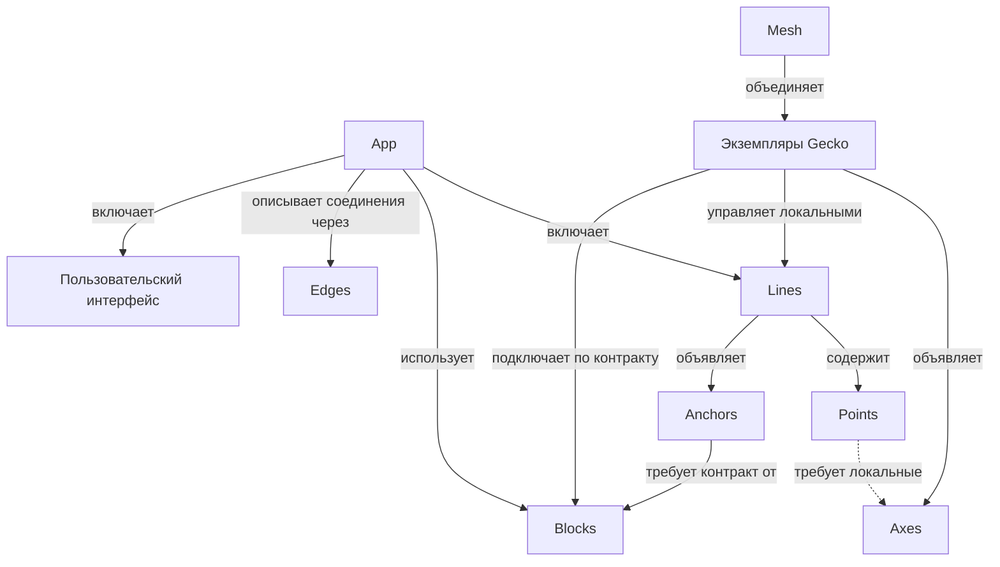

# Gecko — карта понятий

Версия 0.3 · 5 октября 2026 года · [English](concepts.md)

Этот документ задаёт общий язык для проектирования первых версий Gecko. Понятия описывают устройства, конкретное исполнение цепочек обработки, поддержанные соединения и зависимости от общих сервисов. Форматы API, конфигурации и конкретные механизмы реализации будут выбраны отдельно.

Основа — обсуждения [«Сравнение Gecko и Kubernetes»](https://chatgpt.com/g/g-p-6a1ac79a34548191ac02427895e5a00f/c/6ac20d5b-1eb4-83eb-8543-d13148c2f8e1), [«Архитектура пайплайна»](https://chatgpt.com/c/6ac273bd-a1c0-83eb-8759-4d3000c859d8) и последующее уточнение словаря в этом чате. Line задаёт конкретную единицу исполнения; Point обозначает логическую группу внутри Line; Block выполняет предметный контракт, а Anchor явно описывает зависимость Line от него.

**Статус:** согласованный рабочий каркас для проектирования. Он не описывает уже реализованные возможности. Автоматическое размещение, миграция, балансировка и бесшовный failover остаются возможными направлениями развития.

## 1. Основная идея

Gecko работает на конкретном устройстве, объявляет доступные Axes и управляет размещёнными на нём Lines. Доступные друг другу экземпляры Gecko образуют Mesh.

App объединяет Lines, поддержанные соединения обработки, зависимости от Blocks и пользовательский интерфейс. Line состоит из Points и исполняется в одном выделенном процессе с runtime Gecko. Block — общий сервис, выполняющий понятный Gecko предметный контракт. Anchor задаёт зависимость конкретной Line от этого сервиса.

```text
App: inspection

Line front_camera ── Anchor detector ──→ Block inference
Line back_camera  ── Anchor detector ──→ Block inference

Внутри front_camera (соединения реализованы через поддержанные Edges):
Source Point → Inference Point → Tracking Point → Output Point
```

App описывает систему целиком. Line задаёт конкретную границу исполнения, Points — её внутреннюю функциональную структуру. Block обозначает поставщика сервисной возможности; Anchor — требования Line к нему. Владение процессом Block из этого не следует.

## 2. Девять основных терминов

| Термин | Определение | Практическая граница |
|---|---|---|
| **Gecko** | Запущенный экземпляр runtime на конкретной машине или устройстве. | Объявляет возможности, управляет локальными Lines и подключает Blocks по известным контрактам. |
| **Mesh** | Совокупность Gecko, которые обнаружили друг друга и могут взаимодействовать. | Доступная среда; появление участника не перестраивает App автоматически. |
| **App** | Композиция Lines, их Edges и Anchors, используемых Blocks и пользовательского интерфейса для решения задачи. | Может охватывать несколько Gecko; имеет явный состав и зависимости. |
| **Line** | Именованная цепочка обработки из Points с общей конфигурацией, жизненным циклом и диагностикой. | Конкретная единица исполнения: один выделенный процесс с runtime Gecko на одном Gecko. |
| **Point** | Адресуемая логическая группа обработки внутри Line. | Имеет интерфейсы, параметры, результаты и метрики; самостоятельный процесс или перезапуск из этого не следует. |
| **Block** | Общий сервис, выполняющий понятный Gecko предметный контракт. | Может обслуживать несколько Lines; процесс, контейнер и внешний сервис — способы реализации, а не определение Block. |
| **Anchor** | Зависимость Line от общего сервиса, задающая требуемый контракт и условия, при которых Line может работать. | Ссылается на конкретный Block; фиксирует нужные возможности, условия готовности и поведение при недоступности. |
| **Edge** | Поддержанный способ соединения интерфейсов обработки с заданными правилами и ограничениями. | Заранее определяет допустимые связи между Points внутри Line и между выставленными интерфейсами Lines в App; применяется к конкретным участникам при сборке. |
| **Axis** | Возможность среды исполнения, которую объявляет Gecko. Множественное число — **Axes**. | Сопоставляется с локальными требованиями выбранных реализаций; доступность Block проверяется через Anchors. |

«Проект Gecko» означает систему целиком, а «экземпляр Gecko» — конкретный runtime. Машина предоставляет окружение для Gecko. Число экземпляров на одной машине этот документ не ограничивает.

Геометрические названия отражают структуру: Point — функциональная точка внутри Line; Line — цепочка обработки; Block — узел общего сервиса; Edge — поддержанный способ соединения; Anchor — опора Line на сервис. В словаре используется Point. Dot не вводится как отдельная сущность.

## 3. Структура и границы исполнения



Line имеет явную границу: один Gecko и один выделенный процесс с runtime Gecko при исполнении. Размещается Line целиком. Points внутри неё нельзя независимо переносить на другие машины без изменения структуры исполнения.

**Один источник → одна Line — политика по умолчанию.** Источником может быть камера, файл или другой поддержанный источник. Несколько входов в одной Line возможны при явной поддержке такого сценария; это не обязательство первой версии.

Block имеет собственную границу сервиса, которую задаёт его реализация. Общий Block не объединяет Lines и не меняет их границы перезапуска. Gecko может управлять запуском сервиса, если это поддержано, но не устанавливает для каждого Block правило «один выделенный процесс».

UI-элементы принадлежат интерфейсу App. Slider, Button и VideoView не считаются Points обработки внутри Line. Они связываются с доступными интерфейсами и параметрами Lines, их Points и Blocks. Требование отдельного процесса для Line не распространяется на каждый UI-элемент.

## 4. Line и её Points

Line — основная единица эксплуатации обработки: `start`, `stop`, `pause`, `resume`, `reload`, `restart`, состояние, health и логи. Доступность и точная семантика операций зависят от реализации.

Point группирует элементы, реализующие одну понятную функцию:

```text
Inference Point
├── preprocessing
├── inference client или локальный inference
└── postprocessing
```

Point может быть сложным и составным, но остаётся внутри своей Line. Он не скрывает дополнительные самостоятельные Lines или Blocks. Если функция использует общий сервис, зависимость объявляется через Anchor её Line и отображается явно.

| Свойство Point | Пример |
|---|---|
| Входы и выходы | Видео на входе, detections на выходе |
| Параметры | Модель, threshold |
| Требования реализации | Поддерживаемый inference backend |
| Диагностика | Latency, ошибки, preview входа и выхода |

Адресуемость Point позволяет изменить `front_camera.detector.threshold` или посмотреть его метрики. Она не означает независимый `restart(detector)`. Изменение может применяться во время работы либо требовать перестройки или перезапуска Line; это должно быть видно до применения.

Line и GStreamer pipeline тоже имеют разные уровни описания. Line — объект Gecko со стабильным именем, жизненным циклом и выделенным процессом с runtime Gecko; GStreamer pipeline — конкретная реализация её обработки внутри этого runtime. Для первых сценариев они могут соответствовать друг другу напрямую.

## 5. Block и Anchor: общие сервисы и зависимости

**Block — поставщик предметной возможности, Anchor — зависимость Line от этого поставщика.** Например, inference Block предоставляет выполнение моделей, а Block хранения записей — запись и чтение фрагментов видео по камере и времени. Произвольный процесс или база данных рядом не становится Block только благодаря доступному порту.

Контракт Block описывает доступные операции, входы и результаты, сопоставление запросов и ответов, ошибки и доступную диагностику. Для inference он должен позволять узнать модели и версии, их входы и выходы, правила вызова и обработки перегрузки или таймаута. Точный формат контракта будет выбран отдельно.

```text
Line front_camera ── Anchor detector ──→ Block inference
Line back_camera  ── Anchor detector ──→ Block inference

Anchor detector:
  требуемый контракт: inference
  нужная возможность: выбранная модель и версия
  готовность: сервис доступен, контракт совместим, модель готова
  поведение при недоступности: явно выбранная политика Line
```

У каждой Line свой Inference Point, который готовит запросы и принимает ответы. Point использует Block через объявленный Anchor Line; в конфигурации видно, какие Points используют эту зависимость. Сам Anchor не является транспортом: вызовы реализуются клиентом или адаптером контракта. Одна Line может иметь несколько Anchors, а несколько Lines — Anchors на один Block.

Block подключается явно: указываются имя сервиса, контракт и его версия, адрес и поддержанная реализация подключения. Для стороннего сервиса, например Triton, адаптер переводит его интерфейс в контракт Gecko, проверяет совместимость и выясняет доступные возможности. Собственный сервис может реализовывать контракт напрямую. Наличие процесса, контейнера или открытого порта не заменяет такую проверку.

**Zenoh не обязателен для Block.** Обязателен поддержанный способ выполнения контракта. Внешний сервис может использовать свой протокол через адаптер. Discovery в дальнейшем может находить объявления сервисов, но сам по себе не создаёт Anchors.

Управление запуском и выполнение контракта различаются:

- **Внешний сервис:** Gecko подключается к уже работающему Block и не обязан владеть его процессом или предоставлять restart.
- **Сервис под управлением Gecko:** Gecko может запускать и останавливать реализацию Block поддержанным способом. Конкретные механизмы запуска выбираются отдельно.

Перезапуск Line сам по себе не перезапускает общий Block. Отказ Block может затронуть все зависимые Lines; реакция каждой определяется её Anchors. Объявленный Block и Anchors остаются в App при недоступности сервиса. Совместимость контракта, доступность сервиса и готовность нужной возможности показываются отдельно. Anchor не означает исключительного владения Block.

## 6. Edge: поддержанные соединения обработки

**Edge заранее задаёт поддержанный способ соединения интерфейсов обработки.** Он определяет совместимость интерфейсов, механизм передачи данных и ограничения. При сборке Line или App этот способ применяется к одному конкретному выходу и одному конкретному входу. Несколько таких соединений могут образовать many-to-many топологию.

Внутри Line Edges задают допустимые соединения Points, реализованные средствами runtime Gecko. На уровне App они задают допустимые соединения выставленных интерфейсов Lines. Например, `front_camera.video` может представлять выбранный видеовыход её Source Point. Внешняя связь не отменяет принадлежность Point своей Line.

У элемента есть входы и выходы, но совпадение типов данных само по себе не разрешает связь: должен существовать поддержанный Edge. Это позволяет редактору заранее показать допустимые соединения и объяснить ограничения. Разветвление, несколько отправителей на один вход и смешивание потоков требуют явной поддержки.

| Контекст | Что должен поддерживать Edge |
|---|---|
| Между Points одной Line | Совместимость реализаций внутри общей цепочки и процесса |
| Между Lines одного Gecko | Конкретный способ межпроцессной передачи данных |
| Между Lines разных Gecko | Конкретный сетевой путь, форматы и условия передачи |

`unsupported connection` — допустимый результат проверки. Отдельно различаются: поддерживается; не поддерживается; поддерживается, но условия не подходят; ещё не проверено. Наличие Axes не гарантирует соединение. Статус конкретного соединения — диагностика, а не определение Edge.

Зависимость Line от Block описывается Anchor. Проверки «доступен ли Triton?» и «готова ли модель?» относятся к Block и Anchor. Вызовы Block реализуются клиентом или адаптером предметного контракта; они не требуют представления как Edge.

Zenoh обсуждается для discovery, состояния, управления и подходящих данных. Для видео между машинами рассматривался RTSP/RTP. Универсальная передача любого Edge через Zenoh не предполагается. Измерения bandwidth и latency привязаны ко времени и условиям проверки.

## 7. Кто объявляет Axes

**Axes объявляет Gecko.** Points описывают локальные требования выбранной реализации. Требования Line складываются из требований её Points и внутренних Edges; при размещении проверяется Line целиком. Если Gecko управляет запуском Block, локальные требования его реализации проверяются отдельно. Предметные требования Line к Block описываются Anchors, а не Axes.

```text
Gecko jetson-01 объявляет: camera, gstreamer, tensorrt
Gecko desktop-01 объявляет: ui.slider, ui.video_view

Inference Point требует: поддерживаемый inference backend
Line camera_front требует: возможности для всех её Points
```

Требование относится к конкретной реализации. Inference Point с локальной моделью и Inference Point, использующий Block через Anchor, могут иметь разные локальные требования. Наличие удалённого Block не превращает его GPU в локальную Axis другого Gecko.

Capability и текущая доступность ресурсов различаются: наличие TensorRT не подтверждает свободную GPU-память, а наличие камеры — доступ к ней при запуске. Ресурсы, условия Anchors и поддержка Edges проверяются отдельно.

## 8. Process и конкретное исполнение Line

Process не входит в основной предметный словарь, но граница исполнения Line конкретна:

```text
1 запущенная Line → 1 выделенный OS Process с runtime Gecko
```

Runtime исполняет Points и поддержанные соединения внутри Line. Line сохраняет свою идентичность при перезапуске; PID меняется. Конфигурация и диагностика относятся к устойчивому имени, а PID показывается как техническая информация.

```text
Line camera_front → PID 1234
       restart
Line camera_front → PID 5678
```

`pause` означает приостановку обработки по правилам runtime, а не обязательно остановку процесса средствами ОС. `reload` означает применение конфигурации и может потребовать перезапуска. Эти операции не обещают бесшовность любого изменения.

Для Block нет общего правила числа процессов или обязательного runtime Gecko. Его контракт может выполнять сервис в процессе, контейнере или внешней среде. Стабильное имя подключённого Block не зависит от PID его реализации.

Правило выделенного процесса Line не описывает устройство самого экземпляра Gecko или desktop UI. Изоляция процессов также не устраняет общие зависимости от устройств и сервисов.

## 9. Размещение, распределённая обработка и UX

App может исполняться на нескольких Gecko. Каждая Line размещается целиком на одном Gecko. Вынос функции Point за границу Line требует явного изменения структуры: использования сервисного контракта Block через Anchor или выделения части обработки в другую Line с поддержанным Edge.

```text
jetson-01                         gpu-01
Line capture ── video Edge ───→ Line analysis

или:
Line camera ── Anchor detector ──→ Block inference
```

В первом случае проверяется поддержка соединения обработки. Во втором — контракт, реализация подключения и условия Anchor. Место исполнения Block определяется его развёртыванием; управление этим развёртыванием может быть доступно Gecko, но не следует из роли Block.

Единство App не означает общий процесс или единую атомарную паузу: операция над App координирует его участников по выбранной политике. Общий Block не должен автоматически останавливаться, если им пользуются другие приложения.

Editor показывает App с Lines, соединениями через Edges и зависимостями через Anchors на Blocks. Раскрытая Line показывает Points. На уровне Line доступны lifecycle и размещение; на уровне Point — параметры и диагностика. Для Anchor видны требуемый контракт, используемый Block, готовность и политика недоступности. Для Block видны возможности, состояние и доступные операции управления. Перед изменением видны требуемые перезапуски; перед перезапуском Block — зависимые потребители.

Desktop, участвующий в App, тоже является Gecko с UI Axes. Admin / Editor и операторский экран — роли интерфейса. Оператор может видеть только видео и нужные органы управления. Права администратора не следуют из наличия UI Axis.

## 10. Практический workflow первых версий

1. Запустить Gecko на доступных устройствах; обнаружить участников Mesh и их Axes.
2. Создать App и Lines; собрать Points внутри Lines.
3. Выбрать поддержанные Edges для конкретных соединений Points и выставленных интерфейсов Lines; связать пользовательский интерфейс с данными и управлением.
4. Явно подключить нужные Blocks по контрактам и объявить Anchors Lines: возможности, условия готовности и поведение при недоступности.
5. Выбрать Gecko для каждой Line. При поддержанном управлении запуском Block отдельно указать его развёртывание.
6. Проверить локальные требования, ресурсы, каждый Edge и условия каждого Anchor; объяснить ограничения до запуска.
7. Запустить Lines и, при необходимости и наличии управления, сервисы. Показать состояние Lines и Blocks, готовность Anchors и диагностику Points.
8. Применять изменения с явным указанием их масштаба: параметр Point, перезапуск Line, изменение Anchor или операция над Block.

Ручное размещение достаточно для первой версии. Discovery само по себе не соединяет участников и не перестраивает App. Начальный практический сценарий — одна камера или файл, одна Line и один выделенный процесс; общий inference добавляется как Block с явно объявленным Anchor.

## 11. Изменения словаря

### От версии 0.2 к 0.3

| Раньше | Теперь |
|---|---|
| Line и Block — симметричные управляемые единицы исполнения | Line — конкретный процесс с runtime Gecko; Block — сервис, выполняющий предметный контракт |
| Управляемый Block обязательно имеет один выделенный процесс | Способ исполнения Block определяется реализацией; управление запуском отдельно от контракта |
| Зависимости от сервисов не имеют собственного термина | Anchor явно описывает зависимость Line от Block, требования и условия работы |
| Edge — логическая связь, в том числе с Block | Edge задаёт поддержанный способ соединять обработку между Points или Lines; зависимости от Blocks задаются Anchors |
| Подключение внешнего сервиса описано без явной проверки контракта | Block подключается явно через прямую реализацию контракта или адаптер; Zenoh не обязателен |

### Сохранённые изменения версии 0.2 относительно 0.1

App объединяет Lines и UI вместо произвольного графа Points. Point — логическая группа внутри Line; Line — единица размещения и lifecycle. Process — механизм исполнения и диагностическая деталь.

Старые названия Component / Dot соответствуют Point только в контексте внутренней обработки Line. Capability соответствует Axis. Старое Connection обозначало конкретную связь; теперь для неё выбирается поддержанный Edge. Слово «нода» следует уточнять: Gecko — экземпляр runtime; Point — элемент внутри Line.

Сравнение с Kubernetes сохраняет исходный смысл: Gecko понимает media/AI-обработку, поддержанные соединения и предметные зависимости. Kubernetes может быть средой исполнения части системы. Эта карта не устанавливает прямого соответствия Line или Block с Pod.

## 12. Открытые вопросы

- Форматы конфигурации и интерфейсов, их версии и идентичность.
- Правила выставления интерфейсов Points наружу через Line; разделение параметров и управляющих входов.
- Конкретные реализации Points и Edges для первой версии.
- Первый предметный контракт Block (inference), его прямые реализации и адаптер Triton.
- Формат Anchors, привязка использующих их Points и конкретные политики недоступности или неготовности сервиса.
- Семантика pause/reload, политика потери источника или desktop и порядок операций над App.
- Владение общими Blocks, доступ нескольких App, права управления и поддержанные механизмы запуска сервисов.
- Когда нужны автоматическое размещение, миграция, балансировка и восстановление.

Эти вопросы уточняют реализацию, сохраняя основу: Gecko исполняет Lines; Points организуют обработку внутри Line; Edges задают поддержанные соединения; Blocks выполняют предметные контракты; Anchors описывают зависимости Lines от них; Axes описывают локальные возможности Gecko.
