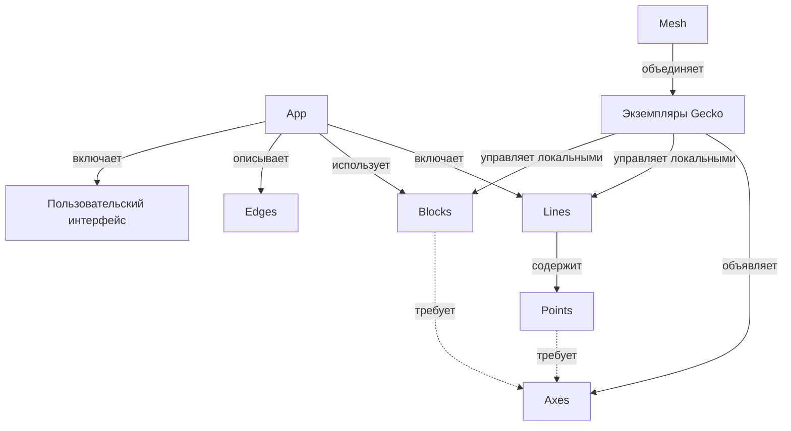

# Gecko — карта понятий

Версия 0.2 · 5 октября 2026 года · [English](concepts.md)

Этот документ задаёт общий язык для проектирования первых версий Gecko. Понятия привязаны к наблюдаемым границам исполнения: устройствам, цепочкам обработки и самостоятельным сервисам. Форматы API, конфигурации и конкретные механизмы реализации будут выбраны отдельно.

Основа — обсуждения [«Сравнение Gecko и Kubernetes»](https://chatgpt.com/g/g-p-6a1ac79a34548191ac02427895e5a00f/c/6ac20d5b-1eb4-83eb-8543-d13148c2f8e1), [«Архитектура пайплайна»](https://chatgpt.com/c/6ac273bd-a1c0-83eb-8759-4d3000c859d8) и последующее уточнение словаря в этом чате. Line и Block возвращают простую модель исполнения; Point обозначает логическую группу внутри Line.

**Статус:** согласованный рабочий каркас для проектирования. Он не описывает уже реализованные возможности. Автоматическое размещение, миграция, балансировка и бесшовный failover остаются возможными направлениями развития.

## 1. Основная идея

Gecko работает на конкретном устройстве, объявляет доступные Axes и управляет размещёнными на нём Lines и Blocks. Доступные друг другу экземпляры Gecko образуют Mesh.

App объединяет Lines, используемые Blocks, связи и пользовательский интерфейс. Line состоит из Points и имеет общий жизненный цикл. Block предоставляет самостоятельный сервис, которым могут пользоваться несколько Lines.

```text
App: inspection

Line front_camera ─┐
                   ├──→ Block inference
Line back_camera ──┘

Внутри front_camera:
Source Point → Inference Point → Tracking Point → Output Point
```

App описывает систему целиком. Line и Block обозначают конкретные управляемые единицы исполнения. Points описывают внутреннюю функциональную структуру Line.

## 2. Восемь основных терминов

| Термин | Определение | Практическая граница |
|---|---|---|
| **Gecko** | Запущенный экземпляр runtime на конкретной машине или устройстве. | Объявляет возможности и управляет локальными Lines и Blocks. |
| **Mesh** | Совокупность Gecko, которые обнаружили друг друга и могут взаимодействовать. | Доступная среда; появление участника не перестраивает App автоматически. |
| **App** | Композиция Lines, Blocks, Edges и пользовательского интерфейса для решения задачи. | Может охватывать несколько Gecko; имеет явный состав и зависимости. |
| **Line** | Именованная цепочка обработки из Points с общей конфигурацией, жизненным циклом и диагностикой. | При запуске исполняется в одном выделенном процессе на одном Gecko. |
| **Point** | Адресуемая логическая группа обработки внутри Line. | Имеет интерфейсы, параметры, результаты и метрики; самостоятельный процесс или перезапуск из этого не следует. |
| **Block** | Самостоятельный сервис со своим интерфейсом, конфигурацией и жизненным циклом. | Может обслуживать несколько Lines; управляемый Gecko Block исполняется в выделенном процессе. |
| **Edge** | Логическая связь между конкретным выходом и входом. | Соединяет интерфейсы Points внутри Line либо выставленные интерфейсы Lines и Blocks на уровне App. |
| **Axis** | Возможность среды исполнения, которую объявляет Gecko. Множественное число — **Axes**. | Сопоставляется с требованиями выбранных реализаций Points и Blocks. |

«Проект Gecko» означает систему целиком, а «экземпляр Gecko» — конкретный runtime. Машина предоставляет окружение для Gecko. Число экземпляров на одной машине этот документ не ограничивает.

Геометрические названия отражают структуру: Point — функциональная точка внутри Line; Line — цепочка обработки; Block — самостоятельный узел сервиса; Edge — связь. В словаре используется Point. Dot не вводится как отдельная сущность.

## 3. Структура и границы исполнения



Line имеет явную границу: один Gecko и один выделенный процесс при исполнении. Размещается Line целиком. Points внутри неё нельзя независимо переносить на другие машины без изменения структуры исполнения.

**Один источник → одна Line — политика по умолчанию.** Источником может быть камера, файл или другой поддержанный источник. Несколько входов в одной Line возможны при явной поддержке такого сценария; это не обязательство первой версии.

Самостоятельный сервис выделяется в Block. Использование общего Block не объединяет Lines и не меняет их границы перезапуска.

UI-элементы принадлежат интерфейсу App. Slider, Button и VideoView не считаются Points обработки внутри Line. Они связываются с доступными интерфейсами и параметрами Lines, их Points и Blocks. Требование отдельного процесса для Line или Block не распространяется на каждый UI-элемент.

## 4. Line и её Points

Line — основная единица эксплуатации обработки: `start`, `stop`, `pause`, `resume`, `reload`, `restart`, состояние, health и логи. Доступность и точная семантика операций зависят от реализации.

Point группирует элементы, реализующие одну понятную функцию:

```text
Inference Point
├── preprocessing
├── inference client или локальный inference
└── postprocessing
```

Point может быть сложным и составным, но остаётся внутри своей Line. Он не скрывает дополнительные самостоятельные Lines или Blocks. Если функция использует удалённый сервис, эта зависимость отображается явно.

| Свойство Point | Пример |
|---|---|
| Входы и выходы | Видео на входе, detections на выходе |
| Параметры | Модель, threshold |
| Требования реализации | Поддерживаемый inference backend |
| Диагностика | Latency, ошибки, preview входа и выхода |

Адресуемость Point позволяет изменить `front_camera.detector.threshold` или посмотреть его метрики. Она не означает независимый `restart(detector)`. Изменение может применяться во время работы либо требовать перестройки или перезапуска Line; это должно быть видно до применения.

Line и GStreamer pipeline тоже имеют разные уровни описания. Line — объект Gecko со стабильным именем и жизненным циклом; GStreamer pipeline — конкретная реализация её обработки. Для первых сценариев они могут соответствовать друг другу напрямую.

## 5. Block и совместное использование

Block имеет собственный жизненный цикл и может обслуживать несколько потребителей. Примеры — общий inference server или сервис хранения. App фиксирует зависимость от Block; из этого не следует исключительное владение сервисом.

```text
Line front_camera → Inference Point ─┐
                                    ├──→ Block inference
Line back_camera  → Inference Point ─┘
```

У каждой Line свой Inference Point, который готовит запросы и принимает ответы. Общий Block выполняет вычисления. Перезапуск одной Line не должен сам по себе перезапускать общий Block. Перезапуск или отказ Block может затронуть все зависимые Lines.

Есть два способа подключения Block:

- **Управляемый:** Gecko запускает и останавливает сервис в выделенном процессе, показывает состояние и диагностику.
- **Внешний:** App использует уже работающий сервис, например Triton. Gecko не обязан владеть его процессом или предоставлять операции его перезапуска.

Эти способы не требуют новых основных терминов. В интерфейсе должно быть видно, какие операции управления доступны и какие Lines зависят от Block.

## 6. Edge и many-to-many

**Каждый Edge соединяет один конкретный выход с одним конкретным входом.** Несколько Edges образуют many-to-many топологию: одна Line может обращаться к нескольким Blocks, а один Block — обслуживать несколько Lines.

Внутри Line Edges соединяют интерфейсы Points. На уровне App они соединяют выставленные интерфейсы Lines и Blocks. Например, `front_camera.video` может представлять выбранный видеовыход её Source Point. Внешняя связь не отменяет принадлежность Point своей Line.

Разветвление, несколько отправителей на один вход и смешивание потоков требуют поддержки соответствующих интерфейсов. Их нельзя вывести только из формы графа.

Edge должен иметь конкретный поддержанный способ реализации:

| Контекст | Что проверяется |
|---|---|
| Между Points одной Line | Совместимость реализаций внутри общей цепочки и процесса |
| Между Lines или Blocks одного Gecko | Реализованный способ межпроцессного обмена |
| Между разными Gecko | Поддержанный сетевой путь, форматы и условия передачи |

`unsupported connection` — допустимый результат проверки. Отдельно различаются: поддерживается; не поддерживается; поддерживается, но условия не подходят; ещё не проверено. Совпадение типов и наличие Axes не гарантируют соединение.

Zenoh обсуждается для discovery, состояния, управления и подходящих данных. Для видео между машинами рассматривался RTSP/RTP. Универсальная передача любого Edge через Zenoh не предполагается. Измерения bandwidth и latency привязаны ко времени и условиям проверки.

## 7. Кто объявляет Axes

**Axes объявляет Gecko.** Point и Block описывают требования выбранной реализации. Требования Line складываются из требований её Points и внутренних соединений; при размещении проверяется Line целиком.

```text
Gecko jetson-01 объявляет: camera, gstreamer, tensorrt
Gecko desktop-01 объявляет: ui.slider, ui.video_view

Inference Point требует: поддерживаемый inference backend
Line camera_front требует: возможности для всех её Points
```

Требование относится к конкретной реализации. Inference Point с локальной моделью и Inference Point, обращающийся к Block, могут иметь разные требования. Наличие удалённого Block не превращает его GPU в локальную Axis другого Gecko.

Capability и текущая доступность ресурсов различаются: наличие TensorRT не подтверждает свободную GPU-память, а наличие камеры — доступ к ней при запуске. Ресурсы, доступность зависимостей и поддержка Edges проверяются отдельно.

## 8. Process — техническая деталь

Process не входит в основной предметный словарь. Правила исполнения для управляемых единиц:

```text
1 запущенная Line                 → 1 выделенный OS Process
1 запущенный управляемый Block    → 1 выделенный OS Process
```

Line или Block сохраняет свою идентичность при перезапуске; PID меняется. Конфигурация и диагностика относятся к устойчивому имени, а PID показывается как техническая информация.

```text
Line camera_front → PID 1234
       restart
Line camera_front → PID 5678
```

`pause` означает приостановку обработки по правилам runtime, а не обязательно остановку процесса средствами ОС. `reload` означает применение конфигурации и может потребовать перезапуска. Эти операции не обещают бесшовность любого изменения.

Правила выделенного процесса не описывают устройство самого runtime Gecko, desktop UI или внешних Blocks. Изоляция процессов также не устраняет общие зависимости от устройств и сервисов.

## 9. Размещение, распределённая обработка и UX

App может исполняться на нескольких Gecko. Каждая Line и каждый управляемый Block размещаются целиком на одном Gecko. Перенос отдельного Point за границу Line требует явного преобразования: обращения к Block или выделения части обработки в другую Line с поддержанным Edge.

```text
jetson-01                         gpu-01
Line capture ── video Edge ───→ Line analysis

или:
Line camera с Inference Point ──→ Block inference
```

Оба варианта должны проверяться как конкретные реализации. Единство App не означает общий процесс или единую атомарную паузу: операция над App координирует его участников по выбранной политике. Общий Block не должен автоматически останавливаться, если им пользуются другие приложения.

Editor показывает App с Lines и Blocks. Раскрытая Line показывает Points. На уровне Line доступны lifecycle и размещение; на уровне Point — параметры и диагностика. Перед изменением видны требуемые перезапуски; перед перезапуском Block — зависимые потребители.

Desktop, участвующий в App, тоже является Gecko с UI Axes. Admin / Editor и операторский экран — роли интерфейса. Оператор может видеть только видео и нужные органы управления. Права администратора не следуют из наличия UI Axis.

## 10. Рабочий сценарий первых версий

1. Запустить Gecko на доступных устройствах; обнаружить участников Mesh и их Axes.
2. Создать App, добавить Lines и нужные Blocks; собрать Points внутри Lines.
3. Выставить необходимые интерфейсы и соединить их Edges; связать пользовательский интерфейс с данными и управлением.
4. Выбрать Gecko для каждой Line и управляемого Block либо указать внешний Block.
5. Проверить требования, ресурсы, зависимости и каждый способ соединения; объяснить ограничения до запуска.
6. Запустить выбранные единицы. Показать состояние Lines и Blocks и диагностику Points.
7. Применять изменения с явным указанием их масштаба: параметр Point, перезапуск Line или операция над Block.

Ручное размещение достаточно для первой версии. Discovery само по себе не соединяет участников и не перестраивает App. Начальный практический сценарий — одна камера или файл, одна Line и один выделенный процесс; общий inference добавляется через Block.

## 11. Изменения относительно версии 0.1

| Раньше | Теперь |
|---|---|
| App — произвольный граф Points | App — композиция Lines, Blocks, Edges и UI |
| Point — функциональная сущность любого масштаба | Point — логическая группа внутри Line с явной границей исполнения |
| Points произвольно группируются по Processes | Points объединяются в Lines; Line — единица размещения и lifecycle |
| Pipeline — внутренняя деталь | Line — основная управляемая цепочка обработки |
| Process — основное понятие | Process — механизм исполнения и диагностическая деталь |
| Общие сервисы не выделены | Block — самостоятельный сервис с явными зависимостями |

Старые названия Component / Dot соответствуют Point только в контексте внутренней обработки Line. Capability соответствует Axis, Connection — Edge. Слово «нода» следует уточнять: Gecko — экземпляр runtime; Point — элемент внутри Line.

Сравнение с Kubernetes сохраняет исходный смысл: Gecko понимает media/AI-обработку и её связи. Kubernetes может быть средой исполнения части системы. Эта карта не устанавливает прямого соответствия Line или Block с Pod.

## 12. Открытые вопросы

- Форматы конфигурации и интерфейсов, их версии и идентичность.
- Правила выставления интерфейсов Points наружу через Line; разделение параметров и управляющих входов.
- Конкретные реализации Points, Blocks и Edges для первой версии.
- Семантика pause/reload, политика потери источника, Block или desktop и порядок операций над App.
- Владение общими Blocks, доступ нескольких App и права управления.
- Когда нужны автоматическое размещение, миграция, балансировка и восстановление.

Эти вопросы уточняют реализацию, сохраняя основу: Gecko управляет Lines и Blocks; Points организуют обработку внутри Line; Edges связывают конкретные интерфейсы; Axes описывают возможности Gecko.
